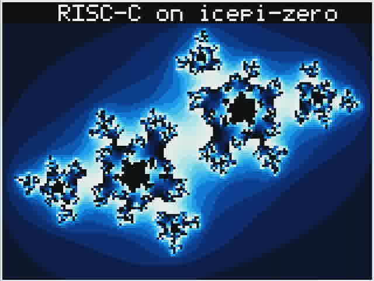

# RISC-C

Author: Arto Vuori <avuori@iki.fi>

RISC-C is more than an RTL core: it is an open 16-bit CPU architecture and
hardware/software project for small controllers. It defines a family of cores
sharing one ISA, from bit-serial designs for very small FPGA or ASIC systems to
full-width and pipelined cores when higher throughput matters. The
architecture is designed to be a practical C/C++ target while keeping the
hardware compact.

The repository brings the whole project together. It contains the normative ISA
and C/object ABI specifications, synthesizable Verilog implementations, and
the tools needed to build and validate them. The toolchain includes an
assembler and instruction-set simulators, along with an LLVM/Clang backend that
compiles C and C++ for RISC-C. Self-checking RTL tests, trace-differential
fuzzing, FPGA flows, and board demos connect the specifications, compiler,
software, and hardware; programs built with the toolchain run on real FPGA
boards as well as in simulation.



*Video capture of RISC-C running on the Icepi Zero FPGA demonstration board.*

Clone RISC-C and its LLVM backend submodule:

```sh
git clone --recurse-submodules https://github.com/risc-c/riscc.git
cd riscc
```

For a clone made without `--recurse-submodules`, initialize it with
`git submodule update --init --recursive`. The checkout records a tested LLVM
revision. Its configured work branch is `riscc-backend`; update that branch
explicitly with `git submodule update --remote external/llvm-project`.

## Documentation

- [Hardware manual](doc/HARDWARE.md) — microarchitectures, FPGA families,
  validation, timing/area results, and examples of running RISC-C on FPGA
  boards.
- [Programming manual](doc/PROGRAMMING.md) — assembly and ISS use,
  LLVM/Clang, application Makefiles, runtime libraries, startup/layouts, TLS,
  interrupts, and split images.
- [RISC-C ISA specification](doc/RISC-C.md) — the normative instruction-set
  definition.
- [RISC-C C and object ABI](doc/RISC-C-ABI.md) — the normative static C/ELF
  interoperability contract.

## Representative results

Nano is the smallest core, but remains a capable embedded CPU. Tiny is the
mainline serial width ladder, from `/1` through `/16`; each width supports all
three mainline profiles. Fast and Faster are the higher-throughput pipelined
full-profile cores.

`min` is the base integer profile. `sys` is the complete system ISA, including
interrupts, except for hardware multiply. `full` adds hardware `MUL`.

| Core family | Profiles | Summary |
|---|---|---|
| Nano | `nano` | Smallest standalone core |
| Tiny `/1` through `/16` | `min`, `sys`, `full` | Serial mainline width ladder |
| Fast | `full` | Two-stage pipelined core |
| Faster | `full` | Higher-performance pipelined core |

Representative implementation results:

| Implementation | Profile | Platform | Logic | Fmax | Benchmark rate |
|---|---|---|---:|---:|---:|
| Nano | `nano` | iCE40 UP5K | 93 LUT4 + 1 EBR | 31.56 MHz | 1.02 MIPS |
| Tiny `/1` through `/16` | `sys` | ECP5 | 149–302 LUT sites + 1 EBR | 85.16–109.23 MHz | 3.04–20.20 MIPS |
| Fast, DSP multiplier | `full` | ECP5 | 450 LUT sites + 1 DSP | 68.00 MHz | 46.05 MIPS |
| Faster, DSP multiplier | `full` | Agilex 3 | 310.4 ALMs + 1 DSP | 251.76 MHz | 119.77 MIPS |

The [Hardware manual](doc/HARDWARE.md#3-current-implementation-results)
contains the complete cross-device matrices, multiplier variants, resource
conventions, and measurement caveats.

## Repository map

| Path | Contents |
|---|---|
| `rtl/` | processor implementations and shared RTL |
| `boards/` | FPGA board SoCs and demonstration firmware |
| `tools/` | assembler, ISS implementations, fuzzing, and image helpers |
| `firmware/` | startup, linker layouts, minimal runtime libraries, and application Makefile support |
| `external/llvm-project/` | LLVM backend submodule; development branch `riscc-backend` |
| `test/` | ISA, RTL, and compiler tests |

## Common commands

The usual complete non-interactive check is:

```sh
make -j16 all
make -j16 test-compiler
```

| Command | Purpose |
|---|---|
| `make -j16 test-all` | Deterministic Verilator RTL regression for every core family. |
| `make -j16 sim-all` | C++ ISS runs for the mainline images and benchmark. |
| `make -j16 test-compiler` | Builds LLVM/Clang when needed, then runs compiler, tiny-libc, TLS, IRQ, ISS, and board-RTL smoke tests. |
| `make -j16 all` | Hardware aggregate: RTL regression, ISS runs, benchmarks, and area reports. It does not include the compiler suite. |
| `make -j16 fuzz-all` | Longer randomized ISS-versus-RTL differential fuzzing. |
| `make -j16 tables` | Regenerates area, Fmax, and benchmark measurement tables; substantially slower. |
| `make icepi-zero-demo-bit` | Builds the Icepi Zero demo bitstream only; it does not program hardware. |
| `make atum-a3-demo` | Builds the Atum A3 Nano demo `.sof`; requires Quartus Pro and does not program hardware. |

See the Hardware manual before running FPGA flows or programming a board, and
the Programming manual before building an application image.
