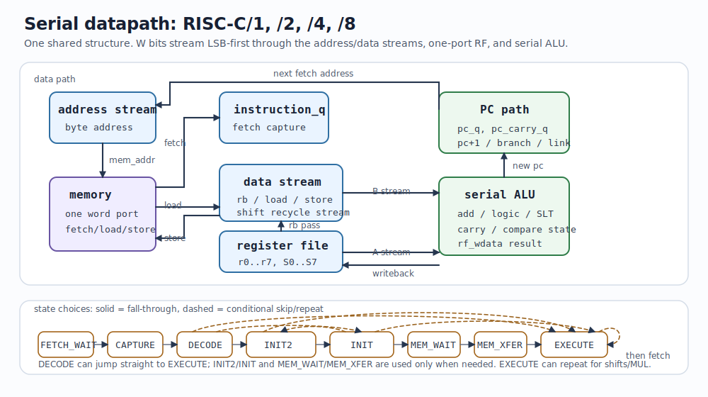
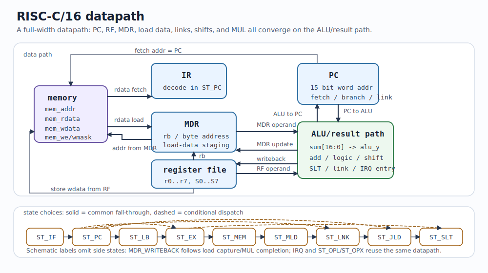
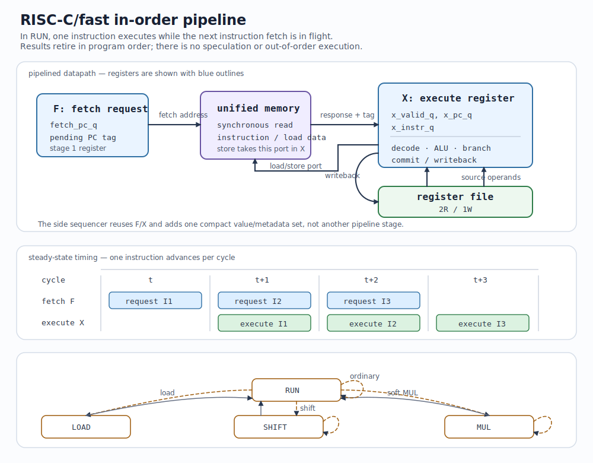
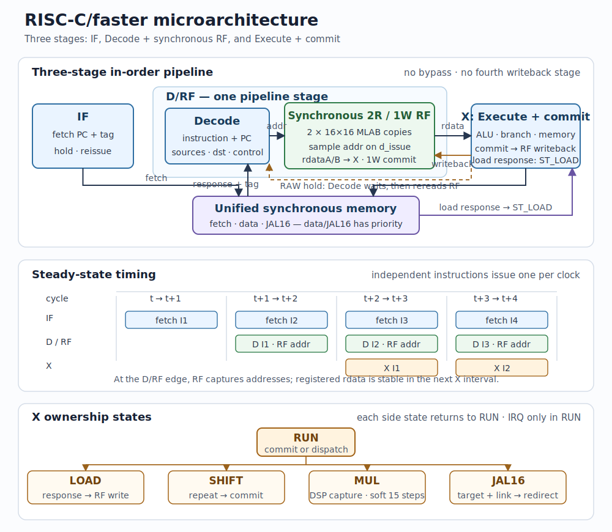
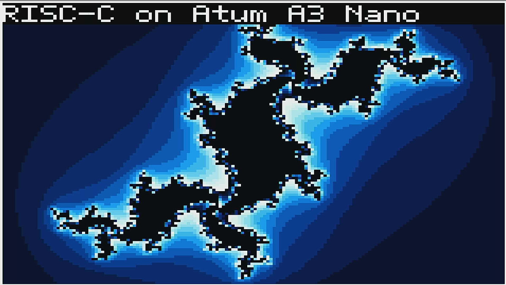

# RISC-C Hardware Manual

This manual covers RISC-C RTL implementations, FPGA targets, validation,
measurement, and board demos. The normative instruction definition is the
[ISA specification](RISC-C-ISA.md). Software development, assembly, C, runtime,
and linker-layout guidance is in the [Programming manual](PROGRAMMING.md).

## 1. Implementation family

RISC-C is implemented as several in-order cores sharing the ISA profiles
defined by the [ISA specification](RISC-C-ISA.md). Datapath width and profile
are selected at build time; the area-critical serial Min profile has its own
specialized RTL source.

| Implementation | RTL | Organization | Profiles |
|---|---|---|---|
| RISC-C/1, /2, /4, /8 Min | [`rtl/riscc_tiny_min.v`](../rtl/riscc_tiny_min.v) | Min-specialized serial datapath, width `W = 1, 2, 4, 8` | `min` |
| RISC-C/1, /2, /4, /8 Sys | [`rtl/riscc_tiny_sys.v`](../rtl/riscc_tiny_sys.v) | serial datapath, width `W = 1, 2, 4, 8` | `sys` |
| RISC-C/1, /2, /4, /8 Full | [`rtl/riscc_tiny_full.v`](../rtl/riscc_tiny_full.v) | serial datapath with hardware multiply, width `W = 1, 2, 4, 8` | `full` |
| RISC-C/16 Min | [`rtl/riscc_tiny16_min.v`](../rtl/riscc_tiny16_min.v) | Min-specialized 16-bit multi-cycle datapath | `min` |
| RISC-C/16 Sys | [`rtl/riscc_tiny16_sys.v`](../rtl/riscc_tiny16_sys.v) | 16-bit multi-cycle datapath | `sys` |
| RISC-C/16 Full | [`rtl/riscc_tiny16_full.v`](../rtl/riscc_tiny16_full.v) | 16-bit multi-cycle datapath with `MUL` | `full` |
| RISC-C/16 Full MulH | [`rtl/riscc_tiny16_full_mulh.v`](../rtl/riscc_tiny16_full_mulh.v) | cost experiment with `MUL`/`MULHU` but no `DIVU` | `full` plus a partial optional extension |
| RISC-C/16 Full MulDiv | [`rtl/riscc_tiny16_full_muldiv.v`](../rtl/riscc_tiny16_full_muldiv.v) | cost experiment with `MUL`/`MULHU`/`DIVU` | `full` plus optional `mdu` |
| RISC-C/nano | [`rtl/riscc_nano1.v`](../rtl/riscc_nano1.v) | fixed one-bit serial datapath | `nano` |
| RISC-C/fast | [`rtl/riscc_fast.v`](../rtl/riscc_fast.v) | two-stage in-order pipeline | `full` |
| RISC-C/faster | [`rtl/riscc_faster.v`](../rtl/riscc_faster.v) | three-stage interlocked pipeline | `full` |

Nano is an incompatible subset profile, not a smaller implementation of
mainline `min`. Fast implements only `full`; Faster is an Agilex-oriented
experiment rather than a mainline width-ladder member.

### Serial Tiny cores

The serial width ladder has three parameterized multi-cycle designs: an
area-specialized Min implementation plus separately specialized Sys and Full
implementations.
Both fetch from a synchronous unified memory port, then stream a 16-bit
operand through a `W`-bit data path least-significant bits first. The same
serial ALU path performs arithmetic, comparison, effective-address, and PC
updates. A one-port register file holds `r0..r7` and `S0..S7`; a second source
is staged before register-register operations. Loads, stores, shifts, and
multiplication add the needed transfer or iteration passes rather than
additional wide datapaths.

Store data is normally read from the one-port register file during the
`MEM_XFER` pass. ECP5 Full `/4` and `/8` instead use a second `INIT2` pass
because that schedule maps smaller there. This is an internal RF schedule;
it does not change the ISA or external memory interface.

The Min-baseline `FSL1` and `FSR1` instructions reuse that staged second
source and the existing shift/ALU paths; they do not add a second wide
datapath. Sys and Full inherit the instructions, while Nano omits them.



Each serial source elaborates the four widths `/1`, `/2`, `/4`, and `/8`.
RISC-C/16 is deliberately separate: it retains a small multi-cycle control
machine but uses a full 16-bit datapath and shared 17-bit result/adder path.

### Nano and RISC-C/16

Nano uses its own fixed one-bit register file, staging, and control structure;
it omits the mainline S-register/system paths. All RISC-C/16 sources use
one-hot multi-cycle control, synchronous unified memory, and a shared MDR
stage for second operands, loads, and byte lanes. The Sys and Full sources
also use that path for `JAL16`; Full adds the multiply machinery.



### Pipelined cores

Fast overlaps a synchronous fetch response with the execution of the current
instruction in a straight two-stage F/X in-order pipeline. Loads, multi-bit
shifts, and soft multiply use small side states. Its register file is
replicated for two reads: ECP5 uses distributed LUTRAM, iCE40 uses EBRs, and
Agilex uses MLAB LUTRAM plus a registered write overlay. There is no branch
predictor or forwarding network; iCE40 can add a RAW stall due to its
synchronous EBR reads.



Faster is a separate three-stage IF/Decode/Execute design for Agilex 3. It
uses two synchronous MLAB register-file replicas and no bypass network; RAW
dependencies interlock in Decode. Its default multiplier is a registered DSP
block, and `RISCC_FASTER_SOFT_MUL` substitutes iterative ALM logic.



## 2. FPGA platforms and configuration

The reference RTL targets iCE40, ECP5, and Agilex 3. The mainline iCE40 cores
use one EBR for the register file and one unified 16-bit synchronous memory
port. With `RISCC_ECP5`, the mainline RF maps to packed distributed LUTRAM;
Fast has its separate replicated two-read RF. On Agilex 3, Tiny/Nano use an
inferred MLAB RF, while Faster uses two MLAB replicas and a registered DSP.

The demonstrated boards are:

- [Icepi Zero](https://github.com/cheyao/icepi-zero), ECP5
  `LFE5U-25F-6BG256C`, using a Fast SoC with on-chip program RAM, DVI
  framebuffer, LEDs, and UART.
- Terasic Atum A3 Nano, Agilex 3 `A3CZ135BB18AE7S`, using a Faster SoC with
  program RAM, UART, framebuffer, and TFP410 HDMI output.

Build profiles are selected at build time. Tiny target names use
`<verb>-<width>-<profile>` for widths `1`, `2`, `4`, `8`, and `16`; Nano uses
`<verb>-nano`. `full` includes `sys`; Fast and Faster have their own targets.
Examples: `make test-16-sys`, `make area-2-min`, and `make fmax-8-full`.

## 3. Current implementation results

Resource use, clock rate, and benchmark throughput are the primary comparison
points. Cycle counts follow them as a reference for implementation work.

| iCE40 LUT4 | /1 | /2 | /4 | /8 | /16 |
|---|---:|---:|---:|---:|---:|
| `min` | 118 | 132 | 161 | 215 | 256 |
| `sys` | 149 | 163 | 200 | 261 | 282 |
| `full` | 173 | 193 | 231 | 300 | 334 |
| nano | 93 | — | — | — | — |
| Fast soft / DSP | — | — | — | — | 480 / 441 |

| ECP5 LUTs (RF included) | /1 | /2 | /4 | /8 | /16 |
|---|---:|---:|---:|---:|---:|
| `min` | 163 | 172 | 201 | 252 | 281 |
| `sys` | 192 | 205 | 237 | 293 | 310 |
| `full` | 213 | 235 | 265 | 331 | 359 |
| nano | 114 | — | — | — | — |
| Fast soft / DSP | — | — | — | — | 497 / 457 |

| ECP5 LUTs (block RF) | /1 | /2 | /4 | /8 | /16 |
|---|---:|---:|---:|---:|---:|
| `min` | 123 | 132 | 165 | 230 | 276 |
| `sys` | 152 | 163 | 202 | 274 | 306 |
| `full` | 172 | 194 | 230 | 312 | 354 |
| nano | 93 | — | — | — | — |

| Agilex 3 ALMs | /1 | /2 | /4 | /8 | /16 |
|---|---:|---:|---:|---:|---:|
| `min` | 75.5 | 89.0 | 91.1 | 116.6 | 133.9 |
| `sys` | 91.0 | 95.7 | 112.0 | 133.0 | 155.4 |
| `full` | 102.0 | 106.8 | 142.0 | 171.1 | 169.0 |
| nano | 75.5 | — | — | — | — |
| Fast soft / DSP | — | — | — | — | 285.0 / 261.0 |
| Faster DSP / soft | — | — | — | — | 349.0 / 339.0 |

### Full multiply/divide experiments

The normal `full` sources retain low-half `MUL` only. Optional-`mdu`
experiments are provided by the separate `/16` multi-cycle sources.

| Implementation | iCE40 LUT4 | ECP5 LUTRAM RF | ECP5 block RF |
|---|---:|---:|---:|
| Full (`MUL`) | 334 | 359 | 354 |
| Full MulH (`MUL` + `MULHU`) | 342 | 372 | 366 |
| Full MulDiv (`MUL` + `MULHU` + `DIVU`) | 387 | 415 | 411 |

| Routed Fmax (MHz) | iCE40 UP5K | ECP5 LFE5U-25F |
|---|---:|---:|
| Full (`MUL`) | 23.06 | 79.37 |
| Full MulH (`MUL` + `MULHU`) | 22.61 | 75.23 |
| Full MulDiv (`MUL` + `MULHU` + `DIVU`) | 19.04 | 72.87 |

These optional-`mdu` timing measurements use the same core-only routed
harness and seed one as the open-FPGA Fmax results elsewhere in this manual.
Use `make fmax-16-mulh` or `make fmax-16-muldiv` to reproduce them.

### Mainline clock rate and throughput

| Fmax (MHz) | /1 | /2 | /4 | /8 | /16 | nano | fast soft | fast DSP | faster DSP | faster soft |
|---|---:|---:|---:|---:|---:|---:|---:|---:|---:|---:|
| iCE40 UP5K | 35.07 | 30.19 | 27.32 | 26.13 | 26.19 | 31.56 | 23.17 | 21.27 | — | — |
| ECP5 LFE5U-25F | 102.12 | 104.42 | 81.04 | 82.24 | 88.64 | 104.07 | 67.82 | 66.13 | — | — |
| Agilex 3 | 305.90 | 284.50 | 276.17 | 247.83 | 217.34 | 306.37 | 195.73 | 152.46 | 251.45 | 247.71 |

Tiny Fmax values use the `sys` profile width ladder. Nano uses its fixed
profile; Fast and Faster use `full`.

The iCE40/ECP5 figures are reproducible v0.16 open-FPGA results. The Agilex
area and Fmax figures are Quartus Pro 26.1 post-fit characterizations for
`A3CZ135BB18AE7S`. Tiny uses the latest Tiny Min and Tiny RTL; Fast and Faster
were refreshed against their current RTL on 2026-07-20.
Agilex Fmax is a restricted-Fmax estimate, not closure at every listed clock.
Run `make -j16 tables` to regenerate the open-FPGA area/Fmax matrices and
benchmarks; the command prints the current Agilex characterization alongside
them. The Fast Agilex characterization defines
`RISCC_FAST_AGILEX` to select the equivalent control-selector copy that packs
best on that family. The Fast and Faster points use a 4 ns target with Quartus
High Performance Effort. Faster has validation and benchmark targets but no
standalone open-FPGA area/Fmax target.

The common benchmark retires 3,165 instructions on mainline, Fast, and Faster,
and 8,418 on Nano because Nano uses software multiply. The Tiny rates combine
the mainline benchmark cycle counts with the `sys` width-ladder clocks above;
Fast and Faster use their matching full-profile clocks.

| Benchmark MIPS | /1 | /2 | /4 | /8 | /16 | nano | fast soft | fast DSP | faster DSP | faster soft |
|---|---:|---:|---:|---:|---:|---:|---:|---:|---:|---:|
| iCE40 UP5K | 0.98 | 1.56 | 2.42 | 3.62 | 6.24 | 1.02 | 12.87 | 14.40 | — | — |
| ECP5 | 2.86 | 5.38 | 7.17 | 11.39 | 21.13 | 3.35 | 37.67 | 44.78 | — | — |
| Agilex 3 | 8.58 | 14.67 | 24.44 | 34.32 | 51.81 | 9.88 | 108.72 | 103.24 | 119.62 | 103.86 |

| Benchmark MIPS/kLUT4 (kLE on Agilex) | /1 | /2 | /4 | /8 | /16 | nano | fast soft | fast DSP | faster DSP | faster soft |
|---|---:|---:|---:|---:|---:|---:|---:|---:|---:|---:|
| iCE40 UP5K | 6.6 | 9.5 | 12.1 | 13.9 | 22.1 | 10.9 | 26.8 | 32.7 | — | — |
| ECP5 block RF | 18.8 | 33.0 | 35.5 | 41.6 | 69.1 | 36.1 | 75.8 | 98.0 | — | — |
| ECP5 LUTRAM RF | 14.9 | 26.3 | 30.3 | 38.9 | 68.2 | 29.4 | 75.8 | 98.0 | — | — |
| Agilex 3 (kLE) | 32.0 | 52.0 | 74.0 | 87.5 | 113.0 | 44.4 | 129.3 | 134.1 | 116.2 | 103.8 |

The Agilex throughput and efficiency rows are derived from the post-fit area
and Fmax characterizations above.

### Cycle counts

All cycle counts run self-checking images to the result-word write. Fast and
Faster implement `full` only; Nano runs its separate profile.

| Validation cycles | /1 | /2 | /4 | /8 | /16 | nano | fast soft | fast DSP | faster DSP | faster soft |
|---|---:|---:|---:|---:|---:|---:|---:|---:|---:|---:|
| `min` | 5516 | 3076 | 1856 | 1246 | 732 | — | — | — | — | — |
| `sys` | 9011 | 4971 | 2967 | 1965 | 1194 | — | — | — | — | — |
| `full` | 10973 | 6013 | 3541 | 2297 | 1376 | — | 558 | 478 | 685 | 755 |
| `nano` | — | — | — | — | — | 3659 | — | — | — | — |

| Common benchmark cycles | /1 | /2 | /4 | /8 | /16 | nano | fast soft | fast DSP | faster DSP | faster soft |
|---|---:|---:|---:|---:|---:|---:|---:|---:|---:|---:|
| `test_riscc_bench` | 112841 | 61393 | 35765 | 22855 | 13276 | 261136 | 5698 | 4674 | 6653 | 7549 |

## 4. FPGA toolchain

The open-source flow needs yosys, Verilator 5 or newer, g++, Python 3,
nextpnr-ice40, nextpnr-ecp5, icestorm, prjtrellis, and optionally ccache and
openFPGALoader. On Debian/Ubuntu:

```sh
sudo apt-get install -y build-essential make python3 ccache libsdl2-dev libstb-dev \
  verilator yosys nextpnr-ice40 nextpnr-ecp5 fpga-icestorm fpga-trellis \
  openfpgaloader
```

The Makefile finds tools on `PATH`; override them per command when necessary,
for example:

```sh
make VERILATOR=/opt/verilator/bin/verilator YOSYS=/opt/yosys/bin/yosys test-all
make NEXTPNR_ECP5=/opt/oss-cad-suite/bin/nextpnr-ecp5 icepi-zero-demo-bit
make QUARTUS_SH=/opt/intelFPGA_pro/26.1/quartus/bin/quartus_sh atum-a3-demo
```

When installed, ccache is automatically used for generated Verilator C++, the
C++ ISS, and host C/C++ compilation for the LLVM build. It uses ccache's
configured persistent directory (normally `~/.cache/ccache`), not `/tmp`.
Yosys synthesis is not a ccache workload.

## 5. Board builds and demos

The current board SoCs share a deliberately small peripheral map.  It is
enough for common demo firmware without forcing the FPGA-specific video,
clocking, RAM-inference, LEDs, or buttons into a shared layer:

| Byte address or range | Demo function |
|---:|---|
| `0x0000..0x7fff` | unified program/data RAM |
| `0x8000..0xa57f` | displayed 160x120 framebuffer: four adjacent 4-bit pixels per 16-bit word; CPU writes only |
| `0xffe0` | interrupt pending: UART bit 0, timer bit 1 (read-only) |
| `0xffe2` | interrupt enable mask: UART bit 0, timer bit 1 (reset masked) |
| `0xffe4` | one-shot 1 kHz timer: write a non-zero delay in milliseconds to arm/rearm; write zero to disarm; read remaining ticks |
| `0xffe6` | free-running 16-bit millisecond tick counter (wraps every 65.536 seconds) |
| `0xffe8` | LED output; Icepi uses five low bits and Atum uses four |
| `0xfff0..0xfff6` | UART; see the [Programming manual](PROGRAMMING.md#1-software-tools-and-the-iss) for register semantics |

The active framebuffer is 4,800 words. The surrounding display aperture and
other high-MMIO addresses are board implementation details; in particular,
the ISS/generic-testbench registers at `0xfff8..0xfffe` are not board devices.
The UART divisor is likewise a board-build setting, not a RISC-C platform
standard. [`<riscc/platform.h>`](../firmware/include/riscc/platform.h) defines
the shared addresses and bits for C code.

The IRQ controller is intentionally only a two-bit level mask: it has no
priority encoder, vectoring, edge capture, or acknowledgement register. A
UART source clears when its peripheral condition clears; a timer source clears
when software writes its next delay. The readable one-shot counter and the
free-running counter use a 1 kHz board-local timebase. A timer IRQ armed with
1,000 ticks supplies a one-second software clock event; software can extend
the 16-bit free-running count across its rollover. Both cores retain their
fixed IRQ vector.

### Icepi Zero

The Icepi demo is in [`boards/icepi_zero`](../boards/icepi_zero). It runs a
50 MHz Fast SoC, a 160x120 4-bit framebuffer scaled to 640x480 DVI, UART,
LEDs, and C++ Julia-set demo firmware. The renderer writes one Julia row per
main-loop iteration. Before every row, its title ticker samples the demo
BSP's 1 kHz `clock()` counter; a fractional accumulator advances it smoothly
at 30 pixels per second.

Its ECP5 PLL wrapper, TMDS encoder, and DDR serializer are maintained under
`boards/icepi_zero/rtl`; the board build has no vendor RTL checkout.

The current ECP5 synthesis of the complete demo uses 885 LUT4s, 21 EBRs,
and one DSP block. The common timer and IRQ mask use ordinary logic; the
framebuffer RAM and DVI pipeline remain Icepi-local.

```sh
make icepi-zero-demo-bin
make icepi-zero-demo-iss
make icepi-zero-demo-iss-test
make icepi-zero-demo-rtlsim
make icepi-zero-demo-json
make icepi-zero-demo-bit
```

The default shared source is
[`demo.cpp`](../boards/shared/sw/demo.cpp), compiled as freestanding C++
without a C++ standard library, exceptions, RTTI, or constructors. For an
alternate C++ or assembly image on both boards, set `DEMO_PROGRAM`. Set
`ICEPI_PROGRAM` or `ATUM_PROGRAM` to override only that board.

The bit target only builds a bitstream. The tested SRAM-load command is:

```sh
openFPGALoader -cft231X --pins=7:3:5:6 build/icepi_zero/demo.bit
```

After loading, wait for USB devices to re-enumerate, then identify any serial
or video interfaces using the host operating system's normal tooling.

The following is a video-capture frame from the Icepi Zero FPGA's physical
video output.


*Video capture of RISC-C running on the Icepi Zero FPGA board.*

### Terasic Atum A3 Nano

[`boards/atum_a3_nano`](../boards/atum_a3_nano) is the Quartus Pro Agilex 3
demo. It runs a 225 MHz Faster SoC, UART, on-chip program RAM, and a 160x120
4-bit framebuffer expanded to 1920x1080p60 through the TFP410. Firmware
source, ISS use, and RTL simulation need no external board checkout. It uses
the same freestanding C++ Julia/timer-ticker source as the Icepi demo, with an
Atum-specific banner:

```sh
make atum-a3-demo-bin
make atum-a3-demo-iss
make atum-a3-demo-rtlsim
```

Generating a `.sof` additionally needs Quartus Pro with Agilex 3 device
support. The project directly instantiates the required IOPLL and
configuration-reset primitives, so it has no external vendor-checkout
dependency:

```sh
make atum-a3-demo
```

The staged project and `.sof` live under `build/atum_a3_nano/quartus`.

#### Running on the board

The normal development flow configures the FPGA through JTAG; it is
temporary and does not change the board's QSPI flash or factory image.

1. Power the board, connect a display to HDMI, and connect the host to the
   board's USB-Blaster III Type-C connector (J4). Install the USB-Blaster III
   driver supplied with Quartus if the cable is not detected.
2. Build the SRAM configuration image:

   ```sh
   make -j16 atum-a3-demo
   ```

3. List the detected programmer cables and devices. Use the cable name printed
   by the first command; `Atum A3 Nano [USB-0]` below is only an example.

   ```sh
   quartus_pgm -l
   quartus_pgm -c "Atum A3 Nano [USB-0]" -a
   ```

4. Configure the FPGA:

   ```sh
   quartus_pgm -c "Atum A3 Nano [USB-0]" -m jtag \
     -o "p;build/atum_a3_nano/quartus/output_files/atum_a3_nano.sof"
   ```

The demo starts when configuration completes. It outputs the 1080p framebuffer
on HDMI and writes `RISC-C on Atum A3 Nano` to the board's USB-UART at 115200
8N1. Identify the serial device with the host operating system's normal
tooling; its name is host-specific. A power cycle or another configuration
restores the image selected by the board's normal boot configuration.

For persistent QSPI programming, generate a `.jic` and follow Terasic's
[Atum A3 Nano documentation](https://www.terasic.com.tw/cgi-bin/page/archive.pl?CategoryNo=44&Language=English&No=1373&PartNo=4).
That intentionally replaces the flash image and is outside this project's
normal development flow.

The shared controller keeps the level-sensitive peripheral-to-CPU interrupt
behind a register, breaking the UART/timer-to-CPU combinational path at the
cost of one system clock of interrupt latency. The 32 KiB unified
program/data RAM remains on the existing shared interface, with no cache, wait
state, or extra memory pipeline stage. The Quartus Pro 26.1 post-fit demo uses
637 ALMs, 21 M20K blocks, one DSP block, and two IOPLLs. Both the 225 MHz
system and 148.5 MHz pixel-clock constraints meet setup timing (0.028 ns and
3.491 ns slack respectively); the system hold slack is 0.022 ns and its
restricted Fmax is 226.45 MHz.



*Video capture of RISC-C running on the Atum-A3-Nano FPGA board.*

## 6. Validation and measurement

```sh
make test-<width>-<profile>   # Tiny width 1/2/4/8/16
make test-nano
make test-fast
make test-faster
make test-funnel
make test-all
make sim-all
make fuzz-all
make bench
make area-table
make fmax-table
make -j16 tables
```

The shared Verilator testbench models synchronous single-port memory and can
inject an external IRQ. Trace builds expose a post-step architectural record:
the next PC, current instruction context, IE, `r0..r7`, and `S0..S7`. The ISS
and RTL must produce identical trace records for the same image; written-memory
records are compared as well.

### Trace comparison

The `trace-*` targets build a trace-enabled Verilator testbench. Build the
matching image first, then compare trace records. The C++ ISS writes traces to
stderr, so redirect it before filtering:

```sh
make trace-16-full > rtl.log 2>&1
build/tools/riscc_sim build/bin/riscc-full.bin --full --trace --dump-written \
  > iss.log 2>&1
grep '^TRACE ' iss.log > iss.trace
grep '^TRACE ' rtl.log > rtl.trace
diff -u iss.trace rtl.trace
```

Use `make trace-nano`, `make trace-<width>-<profile>`, or `make trace-fast`
for the relevant implementation. On a mismatch, compare the first differing
`TRACE` record and then the `MEM` records from `--dump-written`; this separates
an architectural state error from a final-memory error.

### Differential fuzzing

`tools/riscc_fuzz.py` generates deterministic, self-checking assembly programs
from a seed. For each generated binary it first derives the expected state with
the C++ ISS when available (otherwise the Python ISS), then runs a trace-enabled
RTL testbench. It compares every `TRACE` record and every written-memory record,
and the generated program independently checks its final architectural state.

The random programs cover ALU and immediate operations, loads/stores,
forward branches, bounded loops, calls, S-register spills, and for system
profiles IRQ enable/disable and testbench IRQ delivery. Nano uses its own
compatible program shape; Fast uses the full profile.

```sh
make fuzz-all                              # default: 100 fresh seeds/config
FUZZ_SEEDS=1 FUZZ_BASE_SEED=12345 make fuzz-sys
FUZZ_SEEDS=10 FUZZ_BASE_SEED=12345 make fuzz-nano
FUZZ_SEEDS=10 FUZZ_BASE_SEED=12345 make fuzz-fast
```

The command prints the campaign base seed and, on failure, a one-command
replay using the failing seed, profile, and core. For a direct focused run:

```sh
python3 tools/riscc_fuzz.py --seed 12345 --config sys
python3 tools/riscc_fuzz.py --campaign 1 --base-seed 12345 \
  --config sys --cores tiny16
```

Build artifacts, generated programs, traces, and reports belong under
`build/`; keep source-tree RTL and board directories free of generated flow
output.
