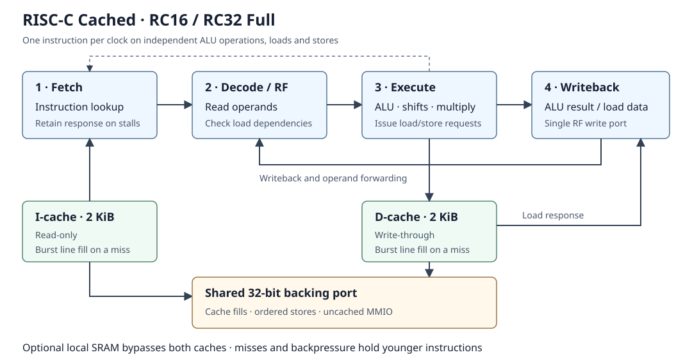

# RISC-C Hardware Manual

This manual describes the cores, memory interfaces, FPGA measurements, and
board builds. See the [ISA specification](RISC-C-ISA.md) for instructions and
the [Programming manual](PROGRAMMING.md) for software development.

## 1. Implementation family

Choose Nano or a narrow serial core for minimum area, Fast for throughput
with on-chip memory, or Cached for memory with longer access latency.
RC16 has 16-bit registers and a 64 KiB address space; RC32 has 32-bit
registers and a 4 GiB address space.

### Core families

| Implementation | Microarchitecture | RTL |
|---|---|---|
| Nano | fixed one-bit serial controller and register file | [`riscc_nano.v`](../rtl/riscc_nano.v) |
| RC16 serial `/1`–`/8` | `W`-bit sliced ALU and one-port register file; `XLEN=16` | [`riscc_serial.v`](../rtl/riscc_serial.v) |
| RC32 serial `/1`–`/16` | `W`-bit sliced ALU over a 16-bit memory port; `XLEN=32` | [`riscc_serial.v`](../rtl/riscc_serial.v) |
| RC16 `/16`, RC32 `/32` | full-width multicycle ALU; Min/Sys/Full and optional MDU | [`riscc_wide.v`](../rtl/riscc_wide.v) |
| Fast | RC16/RC32 Full, compact pipeline | [`riscc_fast.v`](../rtl/riscc_fast.v) |
| Cached | RC16/RC32 Full, compact pipeline with internal I/D caches | [`riscc_cached.v`](../rtl/riscc_cached.v) |

### External memory interfaces

Directions are relative to the core.

| Signal | Direction | Width | Cores | Meaning |
|---|---|---:|---|---|
| `mem_addr` | output | 15 or 31 | serial/wide/Fast | Halfword address; RC32 uses 31 bits, RC16 uses 15 |
| `mem_rdata` | input | 16 | serial/wide/Fast | Read data |
| `mem_wdata` | output | 16 | serial/wide/Fast | Write data |
| `mem_wmask` | output | 2 | serial/wide/Fast | Enables the low and high byte lanes |
| `mem_we` | output | 1 | serial/wide/Fast | Write direction; a one-cycle write strobe on Nano |
| `mem_valid` | output | 1 | serial/wide | Request is active |
| `mem_ready` | input | 1 | serial/wide | Completes the request; read data is valid |
| `mem_cyc` | output | 1 | Fast/Cached | Command or response pending (Wishbone CYC) |
| `mem_stb` | output | 1 | Fast/Cached | Command valid (Wishbone STB) |
| `mem_stall` | input | 1 | Fast/Cached | Target cannot accept the offered command (Wishbone STALL) |
| `mem_ack` | input | 1 | Fast/Cached | Accepted command completed; read data is valid (Wishbone ACK) |
| `mem_oe_n` | output | 1 | Nano | Active-low read enable |

On the serial and wide RC16/RC32 cores, `mem_valid` starts a transfer. The core holds
the address, direction, byte enables, and write data stable until
`mem_ready`. Only one transfer can be outstanding. Halfword accesses enable
both byte lanes; byte accesses enable the addressed lane only.

This handshake is compatible with a small subset of Wishbone B4 Classic:
`mem_addr` maps to `ADR`, `mem_rdata` and `mem_wdata` to `DAT`, `mem_wmask` to
`SEL`, `mem_we` to `WE`, `mem_valid` to both `CYC` and `STB`, and `mem_ready`
to `ACK`. A zero-wait target may tie `mem_ready` high. Bursts, pipelined
transfers, `ERR`, and `RTY` are not supported. Interface outputs are don't-care
when `mem_valid` is low.

Fast uses an ACK-only Wishbone B4 pipelined interface with one accepted request
outstanding. A command is accepted on an edge with
`mem_cyc && mem_stb && !mem_stall`. A stalled command stays stable until
accepted. ACK completes the outstanding request independently of STALL;
completion and replacement can share an edge. When no older request is
pending, ACK may complete the new command on its acceptance edge.
`mem_cyc` stays high while a command or response is pending. `ERR`, `RTY`,
and burst tags are not implemented.

Cached uses the same handshake on a 32-bit, word-addressed backing port:
`mem_addr` has `XLEN-2` bits, `mem_rdata` and `mem_wdata` are 32 bits, and
`mem_wmask` has four byte lanes.
The port carries cache-line fills, write-through stores, and uncached
accesses; instruction requests are 16 bits and data requests are 32 bits internally.

The board SRAM connects directly to the CPU instruction and data ports,
ahead of the caches. SRAM and MMIO return ACK and read data one clock after
acceptance. Writes and MMIO side effects occur at acceptance.

Nano keeps a smaller synchronous-SRAM interface. `mem_oe_n` is the active-low
read enable, and `mem_we` is a one-cycle write enable. Memory returns read data
on the next cycle and must hold it while Nano serializes the 16-bit value.
There is no acknowledge signal or wait-state support. Qualify MMIO read side
effects with `!mem_oe_n` and writes with `mem_we`; address decoding alone can
repeat an access while the address is held.

### Nano

Nano executes one instruction at a time using a one-bit ALU and register
file. It fetches and decodes the instruction, then makes 16-clock passes
over its operands, least-significant bit first. For two-register operations,
one pass saves an operand in a staging register; the execution pass combines
it with the other register's bit stream and writes the result back.

Memory instructions first calculate and retain an address, then transfer
data between the 16-bit memory port and the bit-serial register file.
Stores assemble a complete halfword before writing it. Nano requires
fixed-latency synchronous memory and has no interrupts or wait-state support.

### Serial cores

Serial cores finish one instruction before starting the next. They reuse a
narrow ALU across slices of each operand and share one memory port between
instructions and data. A single-read-port register file supplies operands
in successive passes. Smaller slices save logic but take more clocks.

After fetch and decode, a two-register operation stages one operand while
reading it from the register file. Execution then combines that saved
operand with slices of the other, carrying arithmetic state between slices
and writing the result back. Each full pass takes `XLEN/W` clocks.

Loads and stores use an address-calculation pass followed by a memory
transfer. An address register holds the request stable while memory waits;
a response register holds load data while it is copied into the register
file. Stores assemble their slices into a halfword before issuing the write.
Native RC32 accesses use two successive 16-bit transfers. Once the
instruction completes, the core advances to the next fetch.


`riscc_serial` trades throughput for area by processing `W` bits per clock.
Set `XLEN=16` or `32`, and choose a power-of-two `W` smaller than `XLEN`
(up to 16). `PROFILE=0/1/2` selects Min/Sys/Full. `RESET_PC` is a byte
address. Sys and Full support interrupts between instructions.

Use the full-width core for RC16 `/16` or RC32 `/32`.

### Parameterized full-width core

The full-width core also executes one instruction at a time, but processes
an entire register word in one ALU operation. It shares the ALU between
arithmetic, address calculation, and PC updates. Operand reads and memory
accesses still take separate cycles, keeping the hardware smaller than a
pipelined core.

Fetch retains the instruction, and decode reads the first operand. For a
two-source operation, a staging register saves that operand while the
single read port supplies the second. Execution writes the result back
before the next instruction begins. Immediate operations can skip the
second operand read.

During a load, staging holds the address while a separate scratch register
collects returned data, including both halfwords of an RC32 word. Stores
keep their source on the register-file read port until the transfer finishes.
Multiply and divide reuse the datapath over multiple cycles rather than
requiring a separate fully parallel arithmetic unit.

`riscc_wide` uses one `XLEN`-bit datapath and a synchronous register file.
`XLEN=16/32` selects the architecture; `PROFILE=0/1/2` selects Min/Sys/Full.
`RESET_PC` is a byte address. The Full profile supports three arithmetic
options on both architectures:

| Variant | Parameter | Multiply/divide instructions |
|---|---|---|
| Full | `MDU=0` | MUL |
| Full + MulH | `MDU=1` | MUL, MULHU |
| Full + MulDiv | `MDU=2` | MUL, MULHU, DIVU |

The [ISA specification](RISC-C-ISA.md#appendix-b-multiply-divide-instructions-mdu-extension)
defines the paired-register results of MULHU and DIVU.

Example full-width configurations:

```sh
make test-core PROFILE=sys WIDTH=16
make test-wide XLEN=32 PROFILE=full MDU=2 MODE=ecp5-block
```

### Pipelined core

Fast overlaps three stages, so it can fetch one instruction while decoding
another and executing a third:

| Stage | Work |
| --- | --- |
| Fetch | Request the next instruction through the shared memory port. |
| Decode / register read | Decode the instruction and read both source operands. |
| Execute | Perform the operation, access data memory if needed, and write the result back. |

Two register-file read ports supply both operands together. Forwarding makes
a completing result available to the following instruction without waiting
for another register-file read.

The memory response normally enters decode directly. A holding register
saves a fetched instruction when execution stalls. The execution stage
retains its operands until a load, store, or iterative operation completes;
then the pipeline resumes. Taken control transfers discard younger fetched
instructions and restart fetch at the target.

`riscc_fast` implements Full with `XLEN=16` or `XLEN=32` (default: 16).
Its memory port is 16 bits wide; `RESET_PC` is a halfword address.

With one-clock SRAM, simple instructions sustain one instruction per clock.
Byte and halfword loads/stores add one clock; native RC32 accesses add two.
Taken branches, jumps, and returns add one bubble. Memory stalls stop the
pipeline; interrupts wait for the current instruction to finish.

DSP multiplication takes two Execute clocks. `RISCC_FAST_SOFT_MUL` uses
fabric logic instead, taking `XLEN/2 + 1` clocks.


### Cached core with internal caches

[`riscc_cached`](../rtl/riscc_cached.v) combines a pipeline with separate
2 KiB, direct-mapped instruction and data caches. RC16 uses 32-byte lines;
RC32 uses 64-byte lines. The backing port transfers 32-bit words.
Compile `riscc_fast.v` alongside it for the shared register-file module.

The pipeline has four stages: fetch reads an instruction, decode reads its
operands, execute computes a result or issues a memory request, and writeback
updates the register file. ALU results and loads share one RF write port.
Forwarding handles adjacent ALU dependencies; an instruction that immediately
uses a loaded value waits one clock. Independent loads and stores can advance
every clock on local SRAM or cache hits, provided the backing port accepts
write-through traffic. A store followed by a load of the same cached word
needs an extra RAM read clock.

On a miss, the cache fetches a complete line and holds younger instructions.
Stores update a cached copy if present and acknowledge once their payload is
captured. The backing port retains accepted writes and completes them in
order; no separate write-data FIFO is added. A read miss or uncached read
waits for preceding writes to drain. Taken branches discard younger fetched
instructions. DSP multiplication takes four Execute clocks, or `XLEN/2 + 1`
with `RISCC_FAST_SOFT_MUL`.

The data cache is write-through and does not allocate on a store miss.
`DCACHE_UNCACHED_BIT` selects uncached data and MMIO; its default, `XLEN-1`,
makes the upper half of the address space uncached. Instruction fetches are
cached outside the optional local SRAM, so external executable memory must
support side-effect-free reads of complete cache lines.

`SRAM_ADDR_BITS` optionally places a dual-port SRAM at address zero,
bypassing both caches; 14 selects 16 KiB. `SRAM_HEX` supplies its initial
contents. Instruction and data accesses run independently on the CPU clock
and complete in one clock. A simultaneous instruction fetch and store to
the same SRAM word retries the fetch after the write. With local SRAM enabled,
external instruction-cache lookups take two clocks; data-cache hits take one.
`REGISTER_FETCH` adds an instruction register before decode for higher CPU
clock rates. Arithmetic still sustains one instruction per clock; taken
branches have two bubbles instead of one. Branch targets go directly to the
fetch port. Both board demos enable this option.

Reset clears cache validity in 64 clocks for RC16 or 32 for RC32. Stores
invalidate the corresponding instruction-cache index; a taken jump discards
prefetched instructions. External writers and DMA are not cache-coherent.



*Default pipeline; optional local SRAM connects directly to the CPU instruction
and data ports, ahead of the caches.*

### FPGA build selection

The reference targets are ECP5 and Agilex 3. Select the profile, datapath
width, and register file with Make variables. `make help` lists the targets
and options.

```sh
make test-core PROFILE=sys WIDTH=16 MODE=native
make test-extension EXTENSION=muldiv MODE=ecp5-lutram
make trace PROFILE=min WIDTH=2
make test-fast XLEN=32 MEMORY=ecp5-block MULTIPLIER=dsp
make test-fast-irq XLEN=32
make fuzz-fast32
make bench-fast32
```

Aggregate targets such as `test-cores`, `test-extensions`, `area-lattice`, and
`fmax-lattice` iterate the profile, width, memory, and multiplier lists.

## 2. Measurements

### Measurement conditions

Area includes the core and register file; it excludes program/data memory,
peripherals, and board logic. `/W` is the datapath width in bits. RC16 `/16`
and RC32 `/32` use `riscc_wide`; smaller widths use `riscc_serial`. MulH and
MulDiv are Full-profile options available only at full width. A dash marks
an unsupported configuration.

ECP5 results target the LFE5U-25F, speed grade 6. Area is the minimum LUT4
site count across usable mapping recipes. Clock rates are medians over routing
seeds 1–32, or 1–128 for Nano. Serial and wide cores use the minimum block-RF
area, with ties resolved by median Fmax. Fast uses the recipe with
the highest median MIPS per LUT4 site. Efficiency uses the area of that
timed recipe. Cached ECP5 results use seed 1, with the timed recipe chosen for
MIPS per LUT4 site.

Agilex 3 results use Quartus Pro 26.1, seed 1, and a 4 ns target. The recipe
is Aggressive Area for Full, MulH, and MulDiv, and High Performance Effort
for other profiles. Area is Quartus's **ALMs needed** for the core and MLAB
register file, accounting for estimated dense packing. Fmax is the post-fit
restricted-Fmax estimate; it does not guarantee timing closure at that clock. One ALM counts as
2.95 LEs for efficiency.

Core-only measurements exclude board initialization and are not programmable
board images.

### Area

| ECP5 LUT4 sites (+ 1 RF EBR) | /1 | /2 | /4 | /8 | /16 | /32 |
|---|---:|---:|---:|---:|---:|---:|
| RC16 Min | 123 | 137 | 169 | 193 | 232 | — |
| RC16 Sys | 145 | 155 | 187 | 221 | 253 | — |
| RC16 Full | 175 | 188 | 228 | 297 | 313 | — |
| RC16 Full + MulH | — | — | — | — | 323 | — |
| RC16 Full + MulDiv | — | — | — | — | 357 | — |
| RC32 Min | 147 | 161 | 184 | 217 | 299 | 382 |
| RC32 Sys | 172 | 181 | 212 | 250 | 335 | 410 |
| RC32 Full | 203 | 220 | 259 | 303 | 430 | 508 |
| RC32 Full + MulH | — | — | — | — | — | 518 |
| RC32 Full + MulDiv | — | — | — | — | — | 569 |

| ECP5 LUT4 sites (LUTRAM RF included) | /1 | /2 | /4 | /8 | /16 | /32 |
|---|---:|---:|---:|---:|---:|---:|
| RC16 Min | 165 | 179 | 206 | 225 | 256 | — |
| RC16 Sys | 187 | 198 | 223 | 255 | 277 | — |
| RC16 Full | 218 | 229 | 264 | 330 | 337 | — |
| RC16 Full + MulH | — | — | — | — | 347 | — |
| RC16 Full + MulDiv | — | — | — | — | 381 | — |
| RC32 Min | 233 | 244 | 260 | 284 | 364 | 430 |
| RC32 Sys | 256 | 265 | 289 | 319 | 401 | 458 |
| RC32 Full | 289 | 305 | 335 | 372 | 496 | 556 |
| RC32 Full + MulH | — | — | — | — | — | 566 |
| RC32 Full + MulDiv | — | — | — | — | — | 617 |

| Agilex 3 ALMs (MLAB RF included) | /1 | /2 | /4 | /8 | /16 | /32 |
|---|---:|---:|---:|---:|---:|---:|
| RC16 Min | 96.4 | 111.0 | 113.3 | 122.0 | 121.8 | — |
| RC16 Sys | 112.6 | 117.8 | 121.7 | 130.2 | 150.3 | — |
| RC16 Full | 107.4 | 115.0 | 123.0 | 143.3 | 153.8 | — |
| RC16 Full + MulH | — | — | — | — | 169.1 | — |
| RC16 Full + MulDiv | — | — | — | — | 178.5 | — |
| RC32 Min | 121.3 | 136.3 | 135.0 | 144.0 | 190.1 | 222.6 |
| RC32 Sys | 130.1 | 143.0 | 150.5 | 159.8 | 219.1 | 237.5 |
| RC32 Full | 130.5 | 143.4 | 150.1 | 171.5 | 223.7 | 251.2 |
| RC32 Full + MulH | — | — | — | — | — | 253.4 |
| RC32 Full + MulDiv | — | — | — | — | — | 261.8 |

| Nano, Fast, and Cached area | ECP5 minimum block-RF LUT4 sites | ECP5 minimum LUTRAM-RF sites | ECP5 timed block-RF sites | Agilex 3 ALMs needed, RF included |
|---|---:|---:|---:|---:|
| Nano | 94 | 115 | 94 | 78.9 |
| RC16 Fast DSP | 512 | 545 | 512 | 260.2 |
| RC16 Fast soft | 567 | 592 | 567 | 246.5 |
| RC32 Fast DSP | 882 | 968 | 899 | 438.0 |
| RC32 Fast soft | 952 | 1045 | 952 | 426.6 |
| RC16 Cached soft | 1232 | 1279 | 1331 | 529.4 |
| RC16 Cached DSP | 1193 | 1240 | 1248 | 512.8 |
| RC32 Cached soft | 1885 | 1988 | 2014 | 818.6 |
| RC32 Cached DSP | 1850 | 1944 | 1908 | 789.7 |

ECP5 Nano uses one RF EBR; Fast uses two at either width. ECP5 Fast DSP
uses one DSP block at XLEN=16 and three at XLEN=32; Agilex uses one and two.
The LUTRAM column includes the complete register file. Cached includes both
2 KiB caches, their tags, and the register file; each cache uses one EBR on
ECP5 or one M20K on Agilex. Fast ECP5 timing uses the median over seeds 1–32;
Cached ECP5 timing uses seed 1.

The timed-recipe area column is used for Fmax and efficiency comparisons.

### Clock rate

| ECP5 Fmax (MHz, EBR RF) | /1 | /2 | /4 | /8 | /16 | /32 |
|---|---:|---:|---:|---:|---:|---:|
| RC16 Min | 88.16 | 79.58 | 72.38 | 69.91 | 74.73 | — |
| RC16 Sys | 82.78 | 80.24 | 75.44 | 71.01 | 74.28 | — |
| RC16 Full | 78.40 | 78.12 | 71.70 | 68.17 | 74.52 | — |
| RC16 Full + MulH | — | — | — | — | 73.79 | — |
| RC16 Full + MulDiv | — | — | — | — | 72.25 | — |
| RC32 Min | 86.84 | 79.40 | 70.17 | 64.01 | 65.92 | 68.40 |
| RC32 Sys | 80.38 | 78.63 | 73.97 | 63.00 | 65.89 | 71.35 |
| RC32 Full | 75.64 | 81.16 | 71.47 | 63.83 | 67.99 | 72.37 |
| RC32 Full + MulH | — | — | — | — | — | 73.19 |
| RC32 Full + MulDiv | — | — | — | — | — | 71.35 |

| Agilex 3 Fmax (MHz, MLAB RF) | /1 | /2 | /4 | /8 | /16 | /32 |
|---|---:|---:|---:|---:|---:|---:|
| RC16 Min | 314.47 | 301.30 | 266.88 | 270.86 | 273.75 | — |
| RC16 Sys | 318.07 | 308.17 | 282.33 | 273.37 | 260.96 | — |
| RC16 Full | 290.44 | 279.49 | 265.04 | 262.33 | 223.61 | — |
| RC16 Full + MulH | — | — | — | — | 245.28 | — |
| RC16 Full + MulDiv | — | — | — | — | 242.31 | — |
| RC32 Min | 301.66 | 283.53 | 268.46 | 261.78 | 238.04 | 239.06 |
| RC32 Sys | 295.07 | 287.85 | 273.30 | 267.17 | 253.23 | 247.89 |
| RC32 Full | 267.31 | 291.63 | 267.45 | 243.96 | 217.49 | 213.77 |
| RC32 Full + MulH | — | — | — | — | — | 205.80 |
| RC32 Full + MulDiv | — | — | — | — | — | 218.25 |

| Other implementation Fmax (MHz) | ECP5 EBR RF | Agilex 3, MLAB RF |
|---|---:|---:|
| Nano | 87.11 | 291.80 |
| RC16 Fast DSP | 60.00 | 234.36 |
| RC16 Fast soft | 57.68 | 241.72 |
| RC32 Fast DSP | 54.67 | 223.26 |
| RC32 Fast soft | 54.65 | 216.68 |
| RC16 Cached soft | 52.84 | 205.25 |
| RC16 Cached DSP | 52.20 | 215.42 |
| RC32 Cached soft | 50.55 | 197.16 |
| RC32 Cached DSP | 51.06 | 213.27 |

Fast ECP5 Fmax values are medians over seeds 1–32; Cached values use seed 1.

### RC16 benchmark throughput

Both widths run byte copy, strlen, strcmp, CRC16, 32-bit arithmetic, software
division, bubble sort, and FIR, with matching inputs and loop counts.
`test_riscc_bench` retires 3238 instructions. Nano runs a software-multiply
version with 8491 instructions. MIPS uses each version's instruction count;
compare elapsed time when judging the same workload across those versions.
The benchmark uses MUL but does not exercise MULHU or DIVU.
Fast benchmarks use registered one-clock SRAM responses in Verilator; Cached
uses one-clock native 32-bit SRAM and includes cold-cache initialization and
misses; serial/wide benchmarks use the ready-memory fixture.

Throughput combines the clock rates above with the Verilator cycle counts
below. ECP5 uses the block RF. All cores have the same cycle count on both targets.

| Core | ECP5 MIPS | Agilex MIPS | ECP5 MIPS/kLUT4 | Agilex MIPS/kLE |
|---|---:|---:|---:|---:|
| RC16 Full /1 | 2.29 | 8.47 | 13.1 | 26.7 |
| RC16 Full /2 | 4.28 | 15.33 | 22.8 | 45.2 |
| RC16 Full /4 | 7.03 | 25.98 | 30.8 | 71.6 |
| RC16 Full /8 | 11.02 | 42.41 | 37.1 | 100.3 |
| RC16 Full /16 | 24.76 | 74.29 | 79.1 | 163.7 |
| RC16 Full + MulH /16 | 24.52 | 81.49 | 75.9 | 163.4 |
| RC16 Full + MulDiv /16 | 24.00 | 80.50 | 67.2 | 152.9 |
| Nano | 2.80 | 9.40 | 29.8 | 40.4 |
| RC16 Fast DSP | 44.88 | 175.30 | 87.7 | 228.4 |
| RC16 Fast soft | 39.10 | 163.85 | 69.0 | 225.3 |
| RC16 Cached soft | 35.39 | 137.48 | 26.6 | 88.0 |
| RC16 Cached DSP | 37.44 | 154.53 | 30.0 | 102.1 |

| Core | Cycles |
|---|---:|
| RC16 Full /1 | 111084 |
| RC16 Full /2 | 59052 |
| RC16 Full /4 | 33036 |
| RC16 Full /8 | 20028 |
| RC16 Full /16 | 9746 |
| RC16 Full + MulH /16 | 9746 |
| RC16 Full + MulDiv /16 | 9746 |
| Nano | 263691 |
| RC16 Fast DSP | 4329 |
| RC16 Fast soft | 4777 |
| RC16 Cached soft | 4834 |
| RC16 Cached DSP | 4514 |

### RC32 benchmark throughput

`test_rc32_bench` runs the same eight kernels as RC16 and retires 3123
instructions. Sort and FIR use native 32-bit words; the 32-bit arithmetic
kernel needs fewer instructions than RC16's register pairs. Compare cycle
counts and elapsed time for workload performance; MIPS also reflects these
instruction-count differences. Memory fixtures match those described above.

| Core | Cycles | ECP5 MIPS | Agilex MIPS | ECP5 MIPS/kLUT4 | Agilex MIPS/kLE |
|---|---:|---:|---:|---:|---:|
| RC32 Full /1 | 248336 | 0.95 | 3.36 | 4.7 | 8.7 |
| RC32 Full /2 | 127864 | 1.98 | 7.12 | 9.0 | 16.8 |
| RC32 Full /4 | 67628 | 3.30 | 12.35 | 12.7 | 27.9 |
| RC32 Full /8 | 44978 | 4.43 | 16.94 | 14.6 | 33.5 |
| RC32 Full /16 | 26185 | 8.11 | 25.94 | 18.9 | 39.3 |
| RC32 Full /32 | 11191 | 20.20 | 59.66 | 39.8 | 80.5 |
| RC32 Fast soft | 5775 | 29.55 | 117.18 | 31.0 | 93.1 |
| RC32 Fast DSP | 4815 | 35.46 | 144.81 | 39.4 | 112.1 |
| RC32 Cached soft | 5342 | 29.55 | 115.26 | 14.7 | 47.7 |
| RC32 Cached DSP | 4510 | 35.36 | 147.68 | 18.5 | 63.4 |

### Compiler benchmark cycles

Both widths compile the same C programs at `-O2` for the Full profile.
The RC16 MulH/MulDiv columns reuse the Full binary; MulDiv also speeds up FSL1.

| Benchmark | RC16 Full /16 | RC16 MulH /16 | RC16 MulDiv /16 | RC32 Full /32 |
|---|---:|---:|---:|---:|
| `int32` | 164528 | 164528 | 159828 | 109772 |
| `softfloat` | 386225 | 386225 | 381526 | 722032 |
| `libm32` | 30726 | 30726 | 30320 | 49922 |
| `matrix` | 197998 | 197998 | 195793 | 332295 |
| `structures` | 8102 | 8102 | 8102 | 12336 |
| `memory_copy` | 1143392 | 1143392 | 1143392 | 284289 |
| `memory_update` | 524080 | 524080 | 524080 | 233051 |
| `memory_chase` | 1848547 | 1848547 | 1848547 | 626849 |
| Total | 4303598 | 4303598 | 4291588 | 2370546 |

Pipelined DSP cores with ECP5 block RF:

| Benchmark | RC16 Fast | RC32 Fast | RC16 Cached | RC32 Cached |
|---|---:|---:|---:|---:|
| `int32` | 68486 | 47650 | 76988 | 45705 |
| `softfloat` | 172690 | 343849 | 224328 | 440053 |
| `libm32` | 13880 | 23912 | 21606 | 32298 |
| `matrix` | 86683 | 157459 | 119124 | 150108 |
| `structures` | 3653 | 5944 | 4256 | 7459 |
| `memory_copy` | 455966 | 158007 | 496946 | 183109 |
| `memory_update` | 236410 | 132634 | 186756 | 82509 |
| `memory_chase` | 730229 | 308315 | 867359 | 482501 |
| Total | 1767997 | 1177770 | 1997363 | 1423742 |

The memory tests use volatile 32-bit data and unrolled loops on both widths.
`memory_copy` makes eight round trips between two 4 KiB buffers;
`memory_update` increments a 1 KiB array 64 times; `memory_chase` follows
an 8 KiB chain of indices 16 times, updating each visited node. All verify
every element. Cycle counts include startup, initialization, and verification.

Cached uses the same native 32-bit backing SRAM as the assembly benchmarks:
one-clock responses, accepting one word per clock. Fast uses its direct 16-bit
SRAM port. Cached tests exercise the caches, not the boards' direct local SRAM
or external SDRAM.

```sh
make bench bench-cached
make RISCC_XLEN=16 compiler-benchmarks-rtl
make RISCC_XLEN=32 compiler-benchmarks-rtl
```

The C target runs both `-O2` and `-Os`, with soft and DSP multipliers.
Results are saved in `build/compiler/rc16/full/benchmarks/rtl-cycles.json`
and the corresponding `rc32` directory.

### Reproducing measurements

```sh
make -j16 tables-lattice
make -j16 QUARTUS_SH=/path/to/quartus/bin/quartus_sh tables
```

`tables-lattice` evaluates mapping recipes at routing seed 1 by default and
runs the common RTL benchmark. Set `TUNE_SEEDS=32` for a 32-seed sweep.
Recipe choices and raw results are written under `build/tune/`.

For one full-width configuration:

```sh
python3 tools/lattice_tune.py ecp5 wide32-muldiv --seeds 32 -j 16
```

Use `--resume` to continue an interrupted sweep.

## 3. FPGA toolchain

The open-source flow needs yosys, Verilator 5 or newer, g++, Python 3,
nextpnr-ecp5, prjtrellis, and optionally ccache and openFPGALoader. On
Debian/Ubuntu:

```sh
sudo apt-get install -y build-essential make python3 ccache libsdl2-dev libstb-dev \
  verilator yosys nextpnr-ecp5 fpga-trellis \
  openfpgaloader
```

The Makefile finds tools on `PATH`; override them per command when necessary,
for example:

```sh
make VERILATOR=/opt/verilator/bin/verilator YOSYS=/opt/yosys/bin/yosys test-all
make NEXTPNR_ECP5=/opt/oss-cad-suite/bin/nextpnr-ecp5 icepi-zero-demo-bit
make QUARTUS_SH=/opt/intelFPGA_pro/26.1/quartus/bin/quartus_sh atum-a3-demo
```

## 4. Validation

| Command | Purpose |
| --- | --- |
| `make test-all` | Compiler, ISA, and functional tests |
| `make test-rtl` | All core profiles, widths, and arithmetic variants |
| `make test-fast-irq-all test-wide-irq-all` | Fast and full-width interrupt tests |
| `make test-cached-all test-cached-irq-all` | Caches, pipeline, and interrupts |
| `make fuzz-all` | Randomized programs checked against the simulator |
| `make check-regressions` | Code size, cycle count, and FPGA resource limits |

Fuzz failures print a replay command. To inspect instruction-by-instruction
state, use `make trace PROFILE=full WIDTH=4`, `make trace-nano`, or
`make trace-rc32 PROFILE=full WIDTH=4`.

## 5. Board builds and demos

Both board demos use RC32 Cached with a flat address space and provide:

- 16 KiB directly attached program/data SRAM and cached SDRAM;
- an 8-bit indexed framebuffer in SDRAM and board-local video output;
- a UART, a 1 kHz timer, and a two-source interrupt controller; and
- LED outputs and button inputs.

The shared software-visible map is:

| Byte address or range | Demo function |
|---:|---|
| `0x00000000..0x00003fff` | 16 KiB program/data SRAM |
| `0x10000000..0x11ffffff` | Icepi: 32 MiB cached SDRAM |
| `0x10000000..0x13ffffff` | Atum: 64 MiB cached SDRAM |
| `0x10000000..0x1000e0ff` | Framebuffer within SDRAM: 320×180, one byte per pixel |
| `0xfffff800..0xfffffbff` | Write-only palette: 256 aligned `0x00RRGGBB` words |
| `0xffffffe0..0xffffffe4` | UART; see the [Programming manual](PROGRAMMING.md#bsp-services-and-mmio) for register semantics |
| `0xffffffe8` | timer: write a non-zero 1 kHz delay to arm/rearm; read the free-running 16-bit millisecond tick counter |
| `0xffffffec` | interrupt state: read pending UART/timer bits 0/1; write enable mask |
| `0xfffffff0` | LED output; Icepi uses five low bits and Atum uses four |
| Other addresses | Unmapped; reads return zero, writes are ignored |

[`<riscc/platform.h>`](../firmware/include/riscc/platform.h) defines the shared
C interface. Board builds select RC32 Full firmware automatically. SDRAM
uses a flat physical mapping with no bank register or uncached alias.
SRAM uses separate CPU instruction and data ports and bypasses the caches
and SDRAM clock crossing. Only SDRAM accesses wait for SDRAM initialization.

MMIO registers are 32-bit and four-byte aligned; peripheral values occupy the low bits.

### SDRAM

The shared [controller](../boards/shared/rtl/riscc_sdram.v) has a queued
32-bit word-addressed port with `mem_cyc/stb/stall/ack`, ordered responses,
and four byte enables. It keeps one row open per bank and handles refresh.
A clock bridge fetches each 64-byte CPU cache line as 16 queued reads,
then returns its words from a line buffer. SDRAM stores invalidate that buffer
and acknowledge when admitted. The crossing and arbiter share three command
slots; an outstanding-operation count admits writes while credits remain.
Credits return as the controller captures commands, without a round-trip
handshake for each write. Writes stream until reads or video need the port,
then physical write completions drain before switching. Read grants contain
up to 16 words.
SDRAM runs at 166⅔ MHz; CPU clocks are 55.56 MHz on Icepi and 200 MHz on
Atum. Both use separate PLL output dividers for CPU and memory.

Video fetches 320-byte source rows into two line buffers and reuses each row
for vertical scaling. The CPU is the only framebuffer writer; write-through
stores make updates visible to video without cache writeback. Underruns
blank the affected source row. The 256-colour palette
uses one EBR/M20K block, written by the CPU and read on the pixel clock.

| Board | Wrapper | Memory | Open-row throughput | Test clock |
| --- | --- | ---: | ---: | ---: |
| Icepi Zero | [icepi_sdram.v](../boards/icepi_zero/rtl/icepi_sdram.v) | 32 MiB, x16 | 1 word / 2 clocks | 166⅔ MHz |
| Atum A3 Nano | [atum_sdram.v](../boards/atum_a3_nano/rtl/atum_sdram.v) | 64 MiB, x32 | 1 word / clock | 166⅔ MHz |

Both cache fills and video fetches queue reads without waiting for each word's
response. The controller streams these using its existing BL2 (x16) or BL1
(x32) SDRAM commands, at the open-row rates above.

Shared test logic: [boards/shared/test/sdram](../boards/shared/test/sdram).

Simulation:

```sh
make test-sdram fuzz-sdram
make test-sdram-cpu fuzz-sdram-cpu
make test-sdram-scanout test-video-palette
make test-sdram-bridge fuzz-sdram-bridge
make test-sdram-bench fuzz-sdram-bench
```

### SDRAM hardware tests

Use the normal board SoC with the SDRAM test firmware:

[`hardware_test.cpp`](../boards/shared/test/sdram/hardware_test.cpp) is the
board program; `simulation_test.c` is the short RTL simulation program.
Both use `cached_access_checks.h` for CPU/cache checks.

```sh
make icepi-zero-test-bit
make atum-a3-test QUARTUS_SH=/path/to/quartus_sh
```

Program the board as described below and read its UART at 115200 baud, 8N1.
The CPU checks cached reads, refills, byte/halfword stores, and scattered
accesses, then writes and verifies address-dependent patterns across the
whole SDRAM. It then reports read/write throughput for a warm 1 KiB cache
working set and sequential/scattered accesses over 1 MiB. Each measurement
runs for at least two seconds, with verification outside the timed interval.
Cache and sequential bandwidth use loops unrolled to 32 word accesses, with
no per-word checking or pattern generation. Scattered tests measure the strided
access loop separately. Video scanout remains active.
Progress appears on UART, followed by repeated `CPU SDRAM PASS` or
`CPU SDRAM FAIL`.
Test images are `build/icepi_zero_test/test.bit` and
`build/atum_a3_nano_test/test.sof`.
The Julia demo builds remain separate.

Measured CPU throughput with video active (KiB/s):

| Access | Icepi, CPU 55.56 MHz | Atum, CPU 200 MHz |
|---|---:|---:|
| Warm-cache read, 1 KiB | 160,983 | 579,604 |
| Sequential read, 1 MiB | 60,745 | 161,118 |
| Scattered read, 1 MiB | 3,430 | 8,523 |
| Cached write-through, 1 KiB | 129,306 | 303,799 |
| Sequential write, 1 MiB | 141,981 | 322,588 |
| Scattered write, 1 MiB | 9,859 | 35,224 |

Both boards passed the full-memory pattern checks and benchmark verification.

SDRAM runs at 166⅔ MHz on both boards. Both pass internal timing. External
SDRAM I/O timing is hardware-tested but not fully closed by static analysis.

### Icepi Zero

The [Icepi demo](../boards/icepi_zero) runs RC32 Cached at 55.56 MHz and
scales the 320×180 framebuffer 4× to 1280×720 DVI at 60 Hz. The video PLL
produces 74.286 MHz pixels (60.03 frames/s). Dedicated four-bit I/O gearing
serializes TMDS at 742.86 Mbit/s, with the fabric running at 185.714 MHz.
The register file uses LUTRAM. The test-firmware build uses 4,008 LUT4 sites,
1,986 registers, 12 EBRs, and three DSP blocks.
Post-route Fmax is 57.75 MHz for the CPU, 181.16 MHz for SDRAM,
93.18 MHz for pixels, and 255.30 MHz for the serializer fabric.

```sh
make icepi-zero-demo-iss
make icepi-zero-demo-iss-test
make icepi-zero-demo-rtlsim
make icepi-zero-demo-bit
```

The default shared source is
[`demo.cpp`](../boards/shared/sw/demo.cpp), compiled as freestanding C++
without a C++ standard library, exceptions, RTTI, or constructors. Set
`DEMO_PROGRAM` to use another C++ source on both boards, or `ICEPI_PROGRAM`
or `ATUM_PROGRAM` to override one board. Julia arithmetic uses native 32-bit
products with 14 fractional bits; both demos use the DSP multiplier.
The Julia renderer allows 254 iterations. A square-root colour curve brightens
early escapes, with black interiors and no dithering.

The bit target only builds a bitstream. Load it temporarily through SRAM with:

```sh
openFPGALoader -cft231X --pins=7:3:5:6 build/icepi_zero/demo.bit
```


*Video capture of RISC-C running on the Icepi Zero FPGA board.*

### Terasic Atum A3 Nano

The [Atum demo](../boards/atum_a3_nano) runs RC32 Cached at 200 MHz
and scales the 320×180 framebuffer to 1920×1080p60 through the TFP410.
Board settings and pin assignments are in
[atum_a3_nano.qsf](../boards/atum_a3_nano/atum_a3_nano.qsf).
It uses the same firmware as Icepi.

```sh
make atum-a3-demo-bin
make atum-a3-demo-iss
make atum-a3-demo-rtlsim
```

Generating a `.sof` requires Quartus Pro with Agilex 3 device support:

```sh
make atum-a3-demo
```

The staged project and `.sof` live under `build/atum_a3_nano/quartus`. JTAG
configuration is temporary and leaves the QSPI flash unchanged:

```sh
quartus_pgm -l
quartus_pgm -c "Atum A3 Nano [USB-0]" -m jtag \
  -o "p;build/atum_a3_nano/quartus/output_files/atum_a3_nano.sof"
```

The Quartus Pro 26.1 test-firmware build uses 1,676 ALMs, 2,477 registers,
16 RAM blocks, two DSP blocks, and two IOPLLs. Restricted Fmax is 200.56 MHz
for the CPU, 167.70 MHz for SDRAM, and 315.06 MHz for video. Across timing
corners, internal setup and hold slack are +0.014 ns and +0.050 ns.

Persistent QSPI programming is outside the normal flow; see Terasic's
[Atum A3 Nano documentation](https://www.terasic.com.tw/cgi-bin/page/archive.pl?CategoryNo=44&Language=English&No=1373&PartNo=4).


*Video capture of RISC-C running on the Atum-A3-Nano FPGA board.*
