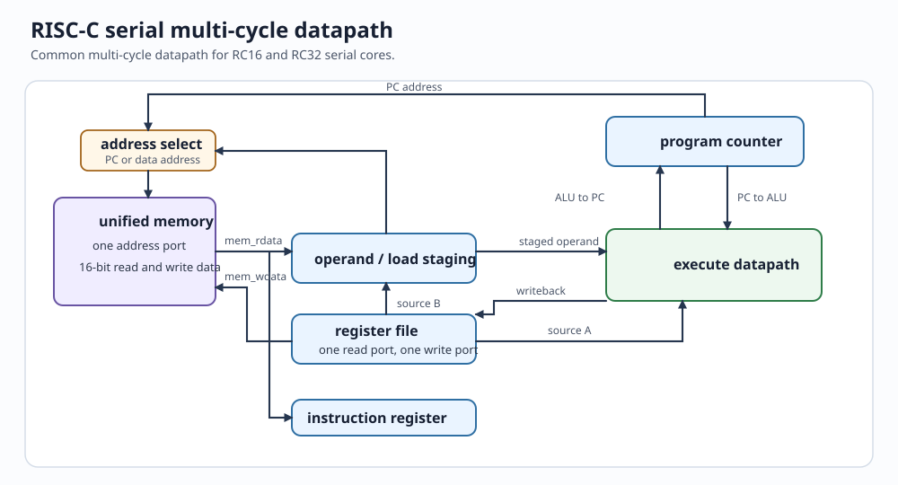

# RISC-C Hardware Manual

This manual covers RISC-C RTL implementations, FPGA targets, validation,
measurement, and board demos. The normative instruction definition is the
[ISA specification](RISC-C-ISA.md). Software development, assembly, C, runtime,
and linker-layout guidance is in the [Programming manual](PROGRAMMING.md).

## 1. Implementation family

RISC-C has serial and pipelined in-order implementations. The serial machines
reuse a small datapath over several cycles; Fast and Faster duplicate more
state and logic to overlap work. Every core uses one synchronous, unified
memory port for instruction fetches and data transfers. The
[ISA specification](RISC-C-ISA.md) defines the architectural configurations;
this section describes how the RTL realizes them.

### Core families

| Implementation | Microarchitecture | RTL |
|---|---|---|
| Nano | fixed one-bit serial controller and register file | [`riscc_nano.v`](../rtl/riscc_nano.v) |
| RC16 serial `/1`–`/8` | `W`-bit sliced ALU and one-port register file | [`riscc_min.v`](../rtl/riscc_min.v), [`riscc_sys.v`](../rtl/riscc_sys.v), [`riscc_full.v`](../rtl/riscc_full.v) |
| RC16 serial `/16` | 16-bit datapath with multi-cycle control | [`riscc16_min.v`](../rtl/riscc16_min.v), [`riscc16_sys.v`](../rtl/riscc16_sys.v), [`riscc16_full.v`](../rtl/riscc16_full.v) |
| RC32 serial `/1`–`/16` | `W`-bit serial 32-bit datapath over a 16-bit memory port | [`riscc32_min.v`](../rtl/riscc32_min.v), [`riscc32_sys.v`](../rtl/riscc32_sys.v), [`riscc32_full.v`](../rtl/riscc32_full.v) |
| Fast | two-stage Fetch/Execute pipeline | [`riscc16_fast.v`](../rtl/riscc16_fast.v) |
| Faster | three-stage Fetch/Decode/Execute pipeline | [`riscc16_faster.v`](../rtl/riscc16_faster.v) |

### External memory interfaces

Directions are relative to the core.

| Signal | Direction | Width | Cores | Meaning |
|---|---|---:|---|---|
| `mem_addr` | output | 15 or 32 | all | Halfword address; RC32 uses 32 bits, the other cores 15 |
| `mem_rdata` | input | 16 | all | Read data |
| `mem_wdata` | output | 16 | all | Write data |
| `mem_wmask` | output | 2 | all | Enables the low and high byte lanes |
| `mem_we` | output | 1 | all | Write direction; a one-cycle write strobe on Nano |
| `mem_valid` | output | 1 | except Nano | Request is active |
| `mem_ready` | input | 1 | except Nano | Completes the request; read data is valid |
| `mem_oe_n` | output | 1 | Nano | Active-low read enable |

On RC16, RC32, Fast, and Faster, `mem_valid` starts a transfer. The core holds
the address, direction, byte enables, and write data stable until
`mem_ready`. Only one transfer can be outstanding. Halfword accesses enable
both byte lanes; byte accesses enable the addressed lane only.

This handshake is compatible with a small subset of Wishbone B4 Classic:
`mem_addr` maps to `ADR`, `mem_rdata` and `mem_wdata` to `DAT`, `mem_wmask` to
`SEL`, `mem_we` to `WE`, `mem_valid` to both `CYC` and `STB`, and `mem_ready`
to `ACK`. A zero-wait target may tie `mem_ready` high. Bursts, pipelined
transfers, `ERR`, and `RTY` are not supported. Interface outputs are don't-care
when `mem_valid` is low.

Nano keeps a smaller synchronous-SRAM interface. `mem_oe_n` is the active-low
read enable, and `mem_we` is a one-cycle write enable. Memory returns read data
on the next cycle and must hold it while Nano serializes the 16-bit value.
There is no acknowledge signal or wait-state support. Qualify MMIO read side
effects with `!mem_oe_n` and writes with `mem_we`; address decoding alone can
repeat an access while the address is held.

The serial cores hold their request state until `mem_ready`, then latch each
16-bit read and consume it a slice at a time. Fast and Faster freeze their
pipelines while a request waits. No wrapper, request queue, or wider internal
datapath is added. Faster samples its level IRQ only on a core-advance
boundary, so an outstanding memory transfer completes before interrupt entry.
The in-tree SoCs acknowledge their synchronous RAM and MMIO one cycle after
the request. Random-stall tests check both delayed responses and request
stability.

### Serial cores

The sliced RC16 `/1` through `/8` and RC32 `/1` through `/16` cores stream an
architectural word through a `W`-bit ALU, least-significant slice first. The
ALU performs arithmetic, comparison, and effective-address formation. A
time-multiplexed register file has one read port and one write port, so a
register-register operation shifts one source through staging before reading
the other: the staging stream is 16 bits in RC16 and 32 bits in RC32. RC32
keeps its 16-bit unified memory port, so every native 32-bit load or store
uses two halfword transfers. Fetch handshake, decode, operand preparation,
memory transfer, and result writeback are distinct controller phases.

RC16 sliced cores use a separate `W`-bit PC-slice adder. RC32 `/1` through
`/4` do likewise; RC32 `/8` and `/16` reuse the serial ALU for PC work in an
extra execution pass.

The sliced controllers capture an instruction on the acknowledged
`FETCH_WAIT` edge and proceed directly to `DECODE`. Simple operations proceed
to `EXECUTE`; forms needing staged operands use `INIT2` and `INIT`, and memory
transfers add `MEM_WAIT` and `MEM_XFER`. Iterative operations repeat counted
slice passes, with the last pass writing the result before the next fetch.

The Sys controllers add saved control state and an interrupt-entry path to the
same serial datapath. The independent RC16 and RC32 Full controllers add
fixed-count shift and iterative low-half multiplication control. RC32 Full
uses the existing address stream as the high multiply accumulator and the data
stream as the multiplier and low product. It alternates serial add and shift
passes and writes the result during the final shift, avoiding a separate
32-bit accumulator bank. Address and data stream rotations each use one
shared enable plus a `W`-bit input selector, rather than replicating source
selection across their 32-bit storage. Conditional branches read r0 in an
operand pass instead of maintaining condition flags on every r0 write. RC32
Full does not implement the optional MDU. Nano is a separate fixed `/1`
design: its one-bit register file, compact decode, and preparation phase are
tailored to the minimal serial schedule rather than being a parameter setting
of the RC16 or RC32 controllers.

RC16 `/16` is a separate multi-cycle implementation with a full-width
datapath. Its single 17-bit ALU completes ordinary arithmetic,
effective-address formation, and PC updates in word-wide passes. Its
full-word register-file read and MDR replace the sliced RF access and shifting
staging register; the MDR holds an operand, effective address, or load value
between controller phases.

The `/16` controller loads an acknowledged fetch directly into its instruction
register and enters Decode. Decode reuses the main adder to advance the PC and
form a taken compact-branch target, after which instructions use operand-load,
execute, memory, and commit states as needed. Min, Sys, MulH, and MulDiv route
an acknowledged load directly to MDR writeback. Full retains one load-capture
stage because sharing that boundary with its long-call and iterative machinery
is smaller on Agilex. The Full controller also adds an operand-load/iterate
pair for multi-cycle shifts and multiplication.

The three forms have the same single-read/single-write RF, unified-memory,
in-order dataflow; they differ in execution width, staging, memory-word
transfer width, and PC-update hardware.

| Structure | RC16 `/1`–`/8` | RC16 `/16` | RC32 `/1`–`/16` |
|---|---|---|---|
| Register and operand staging | `W`-bit RF slices; one operand shifts through a 16-bit staging register | 16-bit RF word; full operand held in MDR | `W`-bit RF slices; 32-bit staging stream |
| Execution | `W+1`-bit ALU with carried state across slices | 17-bit ALU produces a full-word result per pass | `W+1`-bit ALU with carried state across 32-bit words |
| PC update | separate `W`-bit PC adder and carry state | uses the main 17-bit ALU | `/1`–`/4`: dedicated `W`-bit adder; `/8`–`/16`: reuse the serial ALU |
| Store data | uses the RF read output | uses the RF read output | RF slices stream through the staging register into two 16-bit writes |



### Pipelined cores

Fast overlaps a tagged synchronous fetch with Execute. Its two-read register
file is replicated. ECP5 can use either two synchronous EBR copies or an
asynchronous LUTRAM implementation; Agilex uses MLABs. There is no branch
predictor or general forwarding network. The synchronous block-RAM register
file stalls a read-after-write dependency; shifts and multiplication use short
side states while the normal pipeline is paused. Every RF form writes an
acknowledged load directly and resumes the normal pipeline without a load
side state.

Faster separates Fetch, Decode/register-file read, and Execute. Decode drives
two replicated synchronous register files, and their registered outputs feed
Execute. Write-first registered reads handle the normal dependent-writeback
case; the ECP5 block-RF form folds that choice into the read registers instead
of retaining separate wide bypass state.
Loads complete directly on ACK. The DSP form also completes JALL on ACK and
needs three Execute states in a two-bit state register; the fabric form
retains a fourth state for the registered long target. Iterative shifts and
multiplication hold the instruction and operands in Execute-side states until
commit. A registered DSP multiplier is the default;
`RISCC_FASTER_SOFT_MUL` selects the iterative fabric version.


### Serial arithmetic variants

The normal Full `/16` controller has an iterative low-half multiplier. The
paired `mulh` variant adds the high-half path, and `muldiv` adds an iterative
divider. Both retain the shared register file, memory port, and multi-cycle
controller; they are area/latency trade-offs rather than separate
high-throughput execution units. Their architectural definition is in the
[ISA specification](RISC-C-ISA.md#appendix-b-multiply-divide-instructions-mdu-extension).

RC32 Full likewise implements fixed-count shifts and iterative low-half
`MUL`, but it has no RC32 MulH or MulDiv RTL variant. The RC32 MDU encodings
are supported by the toolchain and ISS only; they are not implemented in any
current RC32 `.v` core.

### FPGA build selection

The reference targets are ECP5 and Agilex 3. A single-case build uses
named axes instead of a separate target for every combination. For example:

Run `make help` for the complete list of user targets and selection variables.

```sh
make test-core PROFILE=sys WIDTH=16 MODE=native
make test-extension EXTENSION=muldiv MODE=ecp5-lutram
make trace PROFILE=min WIDTH=2
make test-fast MEMORY=ecp5-block MULTIPLIER=dsp
```

Aggregate targets such as `test-cores`, `test-extensions`, `area-lattice`, and
`fmax-lattice` iterate the profile, width, memory, and multiplier lists.

## 2. Measurements

### Scope and provenance

The resource figures are **core-only**: they count the register file but
exclude instruction/data memory, peripherals, and board logic. Agilex values
are Quartus post-fit measurements, and Agilex Fmax is a restricted-Fmax
estimate, not timing closure at every listed clock. Lattice tables select the
smallest area recipe and the fastest recipe/seed from the recorded tuning
matrix. Agilex runs use seed 1 and a 4 ns target; Quartus uses Aggressive Area
for the Full family, including MulH and MulDiv, and High Performance Effort for
the other cores.

ECP5 with an EBR register file is the small-area reference target. LUTRAM RF
area remains listed as an optional trade-off, while ECP5 routed Fmax,
throughput, and efficiency use the EBR configuration.

Reproduce the tables with:

```sh
make tables-lattice
```

This evaluates all mapping recipes at the common routing seed 1 by default;
selected recipes, options, and the seed are recorded in
`build/tune/ecp5/best.tsv`. `TUNE_SEEDS=128` is available for exploratory
variation studies, but published comparisons use the identical default seed.
Sequential-retiming recipes are excluded: post-synthesis gate regressions did
not preserve the Fast core's behavior.

Include Agilex 3 by providing Quartus Pro:

```sh
make -j$(nproc) QUARTUS_SH=/path/to/quartus/bin/quartus_sh tables
```

Run a focused or whole-matrix tuning search directly with:

```sh
python3 tools/lattice_tune.py ecp5 full --width 4 --seeds 128 -j 16
python3 tools/lattice_tune.py ecp5 sys --width 8 --seeds 128 -j 16
python3 tools/lattice_tune.py ecp5 all --seeds 128 -j 16
```

Each mapper recipe is synthesized once, its seeds are routed in parallel, and
the script reports the best seed per recipe plus the smallest, fastest, and
best-MHz-per-LUT choices. All results are written under `build/tune/` as TSV;
add `--resume` to continue an interrupted whole-matrix run.

### Area

| ECP5 LUT4 sites (+ 1 RF EBR) | /1 | /2 | /4 | /8 | /16 |
|---|---:|---:|---:|---:|---:|
| `min` | 124 | 137 | 165 | 215 | 262 |
| `sys` | 145 | 158 | 191 | 247 | 284 |
| `full` | 172 | 201 | 232 | 300 | 342 |
| RC32 `min` | 153 | 166 | 186 | 230 | 312 |
| RC32 `sys` | 180 | 196 | 216 | 268 | 349 |
| RC32 `full` | 231 | 252 | 294 | 361 | 481 |

| ECP5 LUT4 sites (LUTRAM RF included) | /1 | /2 | /4 | /8 | /16 |
|---|---:|---:|---:|---:|---:|
| `min` | 164 | 176 | 201 | 248 | 288 |
| `sys` | 187 | 199 | 226 | 280 | 310 |
| `full` | 216 | 242 | 271 | 333 | 366 |
| RC32 `min` | 233 | 246 | 265 | 298 | 378 |
| RC32 `sys` | 262 | 275 | 292 | 336 | 415 |
| RC32 `full` | 311 | 334 | 371 | 435 | 548 |

With the ECP5 block RF, RC32 Min uses 7–23% more LUT4 sites than RC16 Min at
the same width. RC32 Sys uses 27–38 more LUT4 sites than RC32 Min. RC32 Full
adds 51–132 sites over RC32 Sys for its repeated shifts and 32-bit iterative
low-half multiplier.

| Agilex 3 ALMs (MLAB RF included) | /1 | /2 | /4 | /8 | /16 |
|---|---:|---:|---:|---:|---:|
| `min` | 92.3 | 100.0 | 108.3 | 126.8 | 120.9 |
| `sys` | 96.5 | 105.2 | 107.9 | 123.5 | 121.9 |
| `full` | 96.6 | 100.7 | 114.4 | 135.9 | 155.1 |
| RC32 `min` | 122.6 | 131.7 | 138.5 | 155.8 | 187.4 |
| RC32 `sys` | 127.5 | 136.6 | 145.7 | 157.2 | 197.7 |
| RC32 `full` | 138.0 | 147.9 | 158.6 | 185.2 | 218.0 |

| Other implementation area | ECP5 block RF LUT4 sites | ECP5 LUTRAM RF sites | Agilex 3 ALM, RF included |
|---|---:|---:|---:|
| nano | 94 | 115 | 86.6 |
| Full paired MulH `/16` | 350 | 374 | 147.9 |
| Full paired MulDiv `/16` | 381 | 405 | 173.4 |
| Fast soft | 521 | 513 | 255.8 |
| Fast DSP | 497 | 485 | 255.7 |
| Faster DSP | 620 | 683 | 286.1 |
| Faster soft | 703 | 760 | 324.5 |

The table headings state whether LUT/ALM values include the register file.
ECP5 Nano, serial, and paired Full cores use one RF EBR; Fast and Faster use
two. DSP-named rows use one DSP. Instruction/data memory and peripherals are
excluded.

### Clock rate and benchmark throughput

| ECP5 Fmax (MHz, EBR RF) | /1 | /2 | /4 | /8 | /16 |
|---|---:|---:|---:|---:|---:|
| `min` | 100.13 | 98.22 | 85.08 | 78.71 | 78.04 |
| `sys` | 99.87 | 95.11 | 84.13 | 75.82 | 75.86 |
| `full` | 94.22 | 92.46 | 80.95 | 77.83 | 78.07 |
| RC32 `min` | 97.85 | 87.86 | 80.32 | 81.03 | 75.13 |
| RC32 `sys` | 98.10 | 94.54 | 84.45 | 80.12 | 74.48 |
| RC32 `full` | 76.77 | 81.54 | 67.69 | 70.66 | 70.18 |

The ECP5 Fmax rows use routing seed 1 for every configuration. This keeps
cross-width and cross-profile comparisons reproducible instead of selecting a
different favorable seed for each point.

| Agilex 3 Fmax (MHz, MLAB RF) | /1 | /2 | /4 | /8 | /16 |
|---|---:|---:|---:|---:|---:|
| `min` | 319.59 | 334.56 | 278.01 | 277.62 | 254.26 |
| `sys` | 312.89 | 335.91 | 278.78 | 268.67 | 272.85 |
| `full` | 283.77 | 264.41 | 269.25 | 261.92 | 231.16 |
| RC32 `min` | 282.01 | 304.60 | 275.48 | 273.45 | 248.51 |
| RC32 `sys` | 264.48 | 297.80 | 267.81 | 269.91 | 258.06 |
| RC32 `full` | 262.67 | 264.41 | 266.17 | 243.31 | 218.10 |

| Other implementation routed Fmax (MHz) | ECP5, EBR RF | Agilex 3, MLAB RF |
|---|---:|---:|
| nano | 95.17 | 316.26 |
| Full paired MulH `/16` | 72.96 | 241.31 |
| Full paired MulDiv `/16` | 70.86 | 230.95 |
| Fast soft | 56.81 | 186.32 |
| Fast DSP | 59.23 | 145.12 |
| Faster DSP | 50.22 | 242.72 |
| Faster soft | 56.41 | 234.19 |

Each throughput entry combines the listed Fmax with the measured cycles of a
common benchmark. The serial columns use the `sys` area/Fmax point. Fast uses
its synchronous-RF cycle count on ECP5 and its generic cycle count on Agilex;
Faster uses its common pipeline cycle count on both families.

| Benchmark MIPS | /1 | /2 | /4 | /8 | /16 | nano | fast soft | fast DSP | faster DSP | faster soft |
|---|---:|---:|---:|---:|---:|---:|---:|---:|---:|---:|
| ECP5, EBR RF | 2.91 | 5.22 | 8.25 | 12.26 | 23.95 | 3.06 | 26.25 | 31.72 | 33.80 | 32.01 |
| Agilex 3 | 9.12 | 18.42 | 27.32 | 43.44 | 86.14 | 10.18 | 104.54 | 98.99 | 163.36 | 132.87 |

The Lattice area and Fmax tables are independent optima and can select
different synthesis parameters. Each Lattice efficiency entry instead uses a
single recipe and seed selected for maximum routed Fmax divided by that same
recipe's area; it does not divide the separately fastest and smallest results.

| Benchmark MIPS per thousand logic units | /1 | /2 | /4 | /8 | /16 | nano | fast soft | fast DSP | faster DSP | faster soft |
|---|---:|---:|---:|---:|---:|---:|---:|---:|---:|---:|
| ECP5, EBR RF LUT4 sites | 20.1 | 33.0 | 42.5 | 49.4 | 84.3 | 30.3 | 49.6 | 63.8 | 54.0 | 45.4 |
| Agilex 3, ALM | 94.5 | 175.1 | 253.2 | 351.7 | 706.6 | 117.6 | 408.7 | 387.1 | 571.0 | 409.5 |

The common benchmark retires 3238 instructions; Nano's software-multiply
version retires 8491. For versions with different dynamic instruction counts,
Fmax divided by benchmark cycles is the fixed-workload throughput measure.

### Benchmark cycles

| Common benchmark cycles | /1 | /2 | /4 | /8 | /16 | nano | fast soft | fast DSP | faster DSP | faster soft |
|---|---:|---:|---:|---:|---:|---:|---:|---:|---:|---:|
| `test_riscc_bench` | 111084 | 59052 | 33036 | 20028 | 10257 | 263691 | 5771 | 4747 | 4811 | 5707 |

The ECP5 Fast block-RF cycle counts are 7007 (soft multiply) and 6047 (DSP
multiply).

### Arithmetic-option cycles

This RTL-cycle comparison uses the baseline Full `/16` core and its MulDiv
variant at `-O2`. Their area and Fmax are reported in the tables above.

| Compiler benchmark | Full cycles | Full + MulDiv cycles | cycle change |
|---|---:|---:|---:|
| `int32` | 170634 | 167324 | -1.94% |
| `softfloat` | 426657 | 410380 | -3.82% |
| `libm32` | 33049 | 31791 | -3.81% |
| `matrix` | 217582 | 210176 | -3.40% |
| `structures` | 8599 | 8379 | -2.56% |
| all five workloads | 856521 | 828050 | -3.32% |

This is a cycle comparison; use the routed Fmax table when judging elapsed
time for a target FPGA.

## 3. FPGA toolchain

The open-source flow needs yosys, Verilator 5 or newer, g++, Python 3,
nextpnr-ecp5, prjtrellis, and optionally ccache and openFPGALoader. On
Debian/Ubuntu:

```sh
sudo apt-get install -y build-essential make python3 ccache libsdl2-dev libstb-dev \
  verilator yosys nextpnr-ecp5 fpga-trellis \
  openfpgaloader
```

The Makefile finds tools on `PATH`; override them per command when necessary,
for example:

```sh
make VERILATOR=/opt/verilator/bin/verilator YOSYS=/opt/yosys/bin/yosys test-all
make NEXTPNR_ECP5=/opt/oss-cad-suite/bin/nextpnr-ecp5 icepi-zero-demo-bit
make QUARTUS_SH=/opt/intelFPGA_pro/26.1/quartus/bin/quartus_sh atum-a3-demo
```

When installed, ccache accelerates generated Verilator C++, the C++ ISS, and
the LLVM host build. Yosys synthesis is not a ccache workload.

## 4. Validation

```sh
make test-all
make test-rtl
make test-compiler
make test-isa
make fuzz-all
make check-regressions
make -j$(nproc) QUARTUS_SH=/opt/intelFPGA_pro/26.1/quartus/bin/quartus_sh tables
```

`test-all` is the complete deterministic correctness gate. It runs the focused
LLVM/Clang/lld tests followed by `test-isa` and `test-compiler`; randomized fuzz
campaigns and synthesis measurements remain separate.
`test-rtl` runs the RC16 matrix, Nano, optional RC16 MulH/MulDiv cores, RC32
Min, Sys, and Full at every width, every Fast target variant, and both ECP5
block-RF and Agilex Faster variants.
`test-compiler` adds compiler, libc, Nano compiler/RTL, and encoding tests.
`test-isa` is the supported-instruction gate. It runs the assembler and
disassembler checks, every directed ISS/RTL instruction suite, and asserts an
external IRQ at every cycle of the interrupt-safe image on every
interrupt-capable RTL width. It additionally injects at every actual memory
wait cycle and ready transition under a fixed stalled-memory schedule. Optional
unimplemented RC32X instructions are not part of this target. The compact RC32
MDU software model receives a directed ISS test only because there is no
matching RTL implementation.
`fuzz-all` differentially compares self-checking generated programs between
the ISS and trace-enabled RTL, reporting a replay command for any failure.
Faster, which has no retirement trace interface, receives final written-memory
comparison plus the generated program's full architectural self-check and a
random external IRQ injection.

`check-regressions` enforces deterministic benchmark image-size and cycle
limits and guarded ECP5 area/Fmax limits for representative RC16, Nano, RC32,
Fast, and Faster configurations. The PPA bounds deliberately allow a small
mapper/P&R margin; published table updates still require the full identical-
seed characterization flow.

Trace targets (`trace PROFILE=<profile> WIDTH=<width>`, `trace-nano`,
`trace-rc32 PROFILE=<profile> WIDTH=<width>`, and `trace-fast`) record
architectural state and written memory after every instruction. The RC32
target selects a Min, Sys, or Full image matching `PROFILE`. Use them to locate
the first divergent instruction when a differential test fails.

## 5. Board builds and demos

Each board SoC provides:

- on-chip program/data RAM;
- a 4-bit framebuffer and board-local video output;
- a UART, a 1 kHz timer, and a two-source interrupt controller; and
- LED outputs and button inputs.

The shared software-visible map is:

| Byte address or range | Demo function |
|---:|---|
| `0x0000..0x7fff` | Unified program/data RAM |
| `0x8000..0xf07f` | 320x180 framebuffer, four 4-bit pixels per 16-bit word; CPU writes only |
| `0xf080..0xffef` | Reserved |
| `0xfff0..0xfff2` | UART; see the [Programming manual](PROGRAMMING.md#bsp-services-and-mmio) for register semantics |
| `0xfff4` | timer: write a non-zero 1 kHz delay to arm/rearm; read the free-running 16-bit millisecond tick counter |
| `0xfff6` | interrupt state: read pending UART/timer bits 0/1; write enable mask |
| `0xfff8` | LED output; Icepi uses five low bits and Atum uses four |

Each displayed framebuffer contains 14,400 16-bit words. The UART divisor is board-local.
[`<riscc/platform.h>`](../firmware/include/riscc/platform.h) defines the shared
C interface.

The interrupt controller is a two-bit level mask for UART and timer sources.
It has no priority, vectoring, edge capture, or acknowledgement register. The
timer uses a board-local 1 kHz timebase, and both boards retain the fixed
RISC-C IRQ vector.

### Icepi Zero

The Icepi demo is in [`boards/icepi_zero`](../boards/icepi_zero). It uses a
50 MHz Fast SoC, a 320x180 4-bit framebuffer scaled to 640x480 DVI, UART,
LEDs, buttons, and freestanding C++ Julia-set firmware. The complete ECP5
design uses 1,391 LUT4s, 32 EBRs, and one DSP block. Its PLL, TMDS encoder, and
DDR serializer are maintained in-tree.

```sh
make icepi-zero-demo-iss
make icepi-zero-demo-iss-test
make icepi-zero-demo-rtlsim
make icepi-zero-demo-bit
```

The default shared source is
[`demo.cpp`](../boards/shared/sw/demo.cpp), compiled as freestanding C++
without a C++ standard library, exceptions, RTTI, or constructors. Set
`DEMO_PROGRAM` to use another C++ source on both boards, or `ICEPI_PROGRAM`
or `ATUM_PROGRAM` to override one board.

The bit target only builds a bitstream. Load it temporarily through SRAM with:

```sh
openFPGALoader -cft231X --pins=7:3:5:6 build/icepi_zero/demo.bit
```


*Video capture of RISC-C running on the Icepi Zero FPGA board.*

### Terasic Atum A3 Nano

[`boards/atum_a3_nano`](../boards/atum_a3_nano) is the Quartus Pro Agilex 3
demo. It combines a Faster SoC, UART, on-chip program RAM, and a 320x180
4-bit framebuffer expanded to 1920x1080p60 through the TFP410. Firmware, ISS,
and RTL simulation use the same freestanding C++ demo as Icepi, with an
Atum-specific banner:

```sh
make atum-a3-demo-bin
make atum-a3-demo-iss
make atum-a3-demo-rtlsim
```

Generating a `.sof` needs Quartus Pro with Agilex 3 device support:

```sh
make atum-a3-demo
```

The staged project and `.sof` live under `build/atum_a3_nano/quartus`. JTAG
configuration is temporary and leaves the QSPI flash unchanged:

```sh
quartus_pgm -l
quartus_pgm -c "Atum A3 Nano [USB-0]" -m jtag \
  -o "p;build/atum_a3_nano/quartus/output_files/atum_a3_nano.sof"
```

The Quartus Pro 26.1 post-fit design uses 689.5 ALMs, 31 M20K blocks, one DSP
block, and two IOPLLs. The 148.5 MHz pixel clock meets timing. The 225 MHz
system target does not close timing; its restricted Fmax is 196.73 MHz.
Persistent QSPI programming is outside the normal flow; see Terasic's
[Atum A3 Nano documentation](https://www.terasic.com.tw/cgi-bin/page/archive.pl?CategoryNo=44&Language=English&No=1373&PartNo=4).


*Video capture of RISC-C running on the Atum-A3-Nano FPGA board.*
