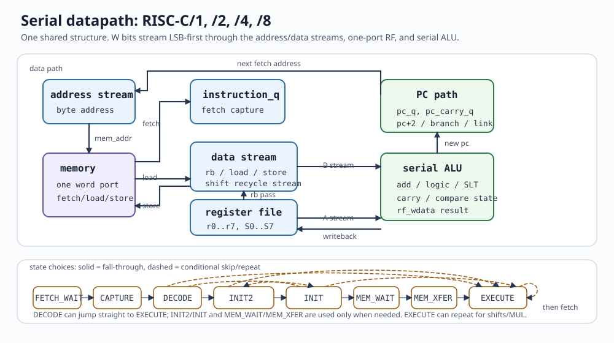
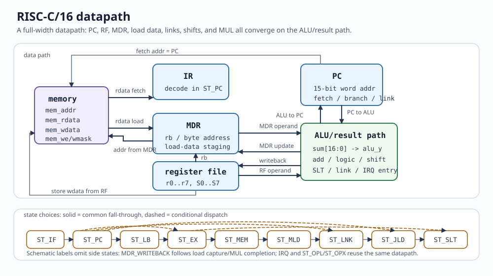
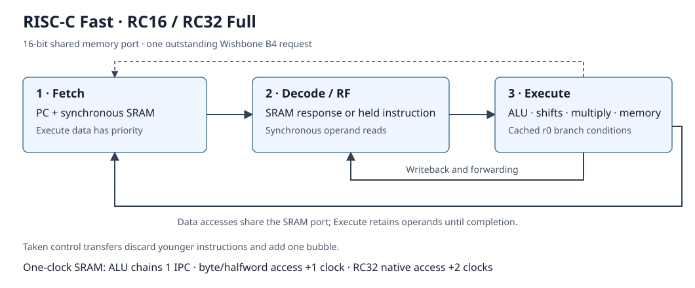
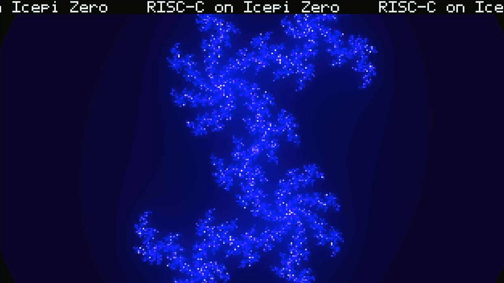
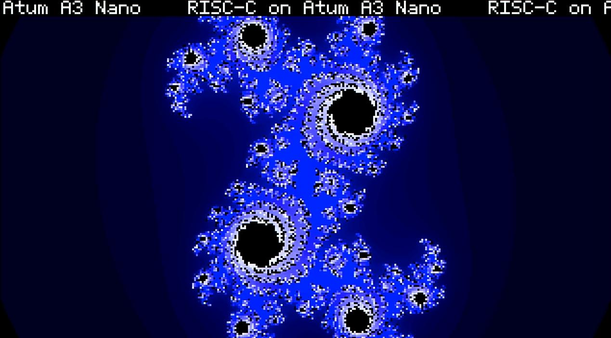

# RISC-C Hardware Manual

This manual covers RISC-C RTL implementations, FPGA targets, validation,
measurement, and board demos. The normative instruction definition is the
[ISA specification](RISC-C-ISA.md). Software development, assembly, C, runtime,
and linker-layout guidance is in the [Programming manual](PROGRAMMING.md).

## 1. Implementation family

RISC-C is implemented as several in-order cores sharing the ISA profiles
defined by the [ISA specification](RISC-C-ISA.md). Datapath width and profile
are selected at build time; the area-critical serial Min profile has its own
specialized RTL source.

| Implementation | RTL | Organization | Profiles |
|---|---|---|---|
| RISC-C/nano | [`rtl/riscc_nano1.v`](../rtl/riscc_nano1.v) | fixed one-bit serial datapath | `nano` |
| RISC-C/fast | [`rtl/riscc_fast.v`](../rtl/riscc_fast.v) | two-stage in-order pipeline | `full` |
| RISC-C/faster | [`rtl/riscc_faster.v`](../rtl/riscc_faster.v) | three-stage interlocked pipeline | `full` |
| RISC-C/1, /2, /4, /8 Min | [`rtl/riscc_tiny_min.v`](../rtl/riscc_tiny_min.v) | Min-specialized serial datapath, width `W = 1, 2, 4, 8` | `min` |
| RISC-C/1, /2, /4, /8 Sys | [`rtl/riscc_tiny_sys.v`](../rtl/riscc_tiny_sys.v) | serial datapath, width `W = 1, 2, 4, 8` | `sys` |
| RISC-C/1, /2, /4, /8 Full | [`rtl/riscc_tiny_full.v`](../rtl/riscc_tiny_full.v) | serial datapath with hardware multiply, width `W = 1, 2, 4, 8` | `full` |
| RISC-C/16 Min | [`rtl/riscc_tiny16_min.v`](../rtl/riscc_tiny16_min.v) | Min-specialized 16-bit multi-cycle datapath | `min` |
| RISC-C/16 Sys | [`rtl/riscc_tiny16_sys.v`](../rtl/riscc_tiny16_sys.v) | 16-bit multi-cycle datapath | `sys` |
| RISC-C/16 Full | [`rtl/riscc_tiny16_full.v`](../rtl/riscc_tiny16_full.v) | 16-bit multi-cycle datapath with `MUL` | `full` |

Nano is an incompatible subset profile, not a smaller implementation of
mainline `min`. Fast implements only `full`; Faster is an Agilex-oriented
experiment rather than a mainline width-ladder member.

### Serial Tiny cores

The serial width ladder has three parameterized multi-cycle designs: an
area-specialized Min implementation plus separately specialized Sys and Full
implementations.
Both fetch from a synchronous unified memory port, then stream a 16-bit
operand through a `W`-bit data path least-significant bits first. The same
serial ALU path performs arithmetic, comparison, effective-address, and PC
updates. A one-port register file holds `r0..r7` and `S0..S7`; a second source
is staged before register-register operations. Loads, stores, shifts, and
multiplication add the needed transfer or iteration passes rather than
additional wide datapaths.

Store data is normally read from the one-port register file during the
`MEM_XFER` pass. Sys `/1` and Full `/4` and `/8` instead use a second `INIT2`
pass because that schedule maps smaller. This is an internal RF schedule; it
does not change the ISA or external memory interface.

The Min-baseline `FSL1` and `FSR1` instructions stage the endpoint source
`ra`, then read and shift the old value of `rd` through the existing shift/ALU
paths; they do not add a second wide datapath. Sys and Full inherit the
instructions, while Nano omits them.

`LDX` and `LDPH` share the native-load schedule. `LDX` stages `rb` as the
index added to `ra`; `LDPH` uses `ra` as its sole pointer and reuses the same
transfer path for program memory. Direct `LDB`, `LDBS`, and `STB` also use
`ra` with a zero second addend. In direct typed encodings, `bbb` refines width
and address space and is not read as a register selector.

Equivalent decode and operand-select expressions map differently across
Yosys targets and serial widths. The build therefore selects characterized
compile-time factorizations for some Sys and Full points. These selections
only refactor Boolean controls and source selectors; instruction behavior,
state sequencing, and the external memory interface are unchanged.



Each serial source elaborates the four widths `/1`, `/2`, `/4`, and `/8`.
RISC-C/16 is deliberately separate: it retains a small multi-cycle control
machine but uses a full 16-bit datapath and shared 17-bit result/adder path.

### Nano

Nano uses its own fixed one-bit register file, staging, and control structure;
it omits the mainline S-register/system paths.

### RISC-C/16

All RISC-C/16 sources use one-hot multi-cycle control, synchronous unified
memory, and a shared MDR stage for second operands, loads, and byte lanes.
`LDPH` selects `ra` during operand load and then reuses the native-load
sequence. The Sys and Full sources also use the MDR path for the following
halfword of `JAL16`; Full adds the multiply machinery.



### Pipelined cores

Fast overlaps a synchronous fetch response with the execution of the current
instruction in a straight two-stage F/X in-order pipeline. Loads, multi-bit
shifts, and soft multiply use small side states. Its register file is
replicated for two reads: ECP5 uses distributed LUTRAM, iCE40 uses EBRs, and
Agilex uses MLAB LUTRAM plus a registered write overlay. iCE40 retains the
accepted source addresses for a possible synchronous-RF replay, ECP5 registers
both source addresses with the X-stage instruction, and Agilex DSP registers
only the B address. The iCE40 and ECP5 DSP datapaths route logic through ALU-A;
their soft builds use the shared result path. Agilex soft splits both logic and
load results from the shared path, while Agilex DSP uses the shared path.
`LDPH` uses `ra` on the existing load source path; `bbb=011` is decode-only.
There is no branch predictor or forwarding network; iCE40 can add a RAW stall
due to its synchronous EBR reads.



Faster is a separate three-stage IF/Decode/Execute design for Agilex 3. It
uses two synchronous MLAB register-file replicas with an explicit write-edge
bypass, so a dependent instruction can issue as its producer writes back. For
`LDPH`, both read ports select `ra`; the existing adder forms `2*ra`, and its
normal halfword-address extraction produces the program address without a
new shifter. Its default multiplier is a registered DSP block, and
`RISCC_FASTER_SOFT_MUL` substitutes iterative ALM logic. The DSP build retains
the compact binary side-state encoding; the soft build lets Quartus choose
its state encoding and uses a separately factored ALU operand path that maps
better in fabric.


## 2. FPGA platforms and configuration

The reference RTL targets iCE40, ECP5, and Agilex 3. The mainline iCE40 cores
use one EBR for the register file and one unified 16-bit synchronous memory
port. With `RISCC_ECP5`, the mainline RF maps to packed distributed LUTRAM;
Fast has its separate replicated two-read RF. On Agilex 3, Tiny/Nano use an
inferred MLAB RF, while Faster uses two MLAB replicas and a registered DSP.

Build profiles are selected at build time. Tiny target names use
`<verb>-<width>-<profile>` for widths `1`, `2`, `4`, `8`, and `16`; Nano uses
`<verb>-nano`. `full` includes `sys`; Fast and Faster have their own targets.
The optional Tiny16 Full cores use the `mulh` and `muldiv` suffixes. Examples:
`make test-16-sys`, `make test-16-muldiv`, `make area-2-min`, and
`make fmax-8-full`.

## 3. Current implementation results

Resource use, clock rate, and benchmark throughput are the primary comparison
points. Cycle counts follow them as a reference for implementation work.

| iCE40 LUT4 | /1 | /2 | /4 | /8 | /16 |
|---|---:|---:|---:|---:|---:|
| `min` | 118 | 132 | 160 | 218 | 260 |
| `sys` | 150 | 165 | 198 | 260 | 290 |
| `full` | 166 | 185 | 229 | 298 | 335 |
| nano | 93 | — | — | — | — |
| Fast soft / DSP | — | — | — | — | 487 / 450 |

| ECP5 LUTs (RF included) | /1 | /2 | /4 | /8 | /16 |
|---|---:|---:|---:|---:|---:|
| `min` | 163 | 174 | 199 | 253 | 284 |
| `sys` | 189 | 204 | 235 | 295 | 316 |
| `full` | 207 | 229 | 268 | 334 | 361 |
| nano | 114 | — | — | — | — |
| Fast soft / DSP | — | — | — | — | 516 / 475 |

| ECP5 LUTs (block RF) | /1 | /2 | /4 | /8 | /16 |
|---|---:|---:|---:|---:|---:|
| `min` | 121 | 134 | 164 | 221 | 260 |
| `sys` | 147 | 163 | 200 | 261 | 292 |
| `full` | 165 | 188 | 232 | 300 | 337 |
| nano | 93 | — | — | — | — |

| Agilex 3 ALMs | /1 | /2 | /4 | /8 | /16 |
|---|---:|---:|---:|---:|---:|
| `min` | 93.7 | 100.1 | 108.0 | 120.1 | 118.0 |
| `sys` | 108.1 | 116.2 | 121.6 | 141.9 | 145.2 |
| `full` | 100.8 | 121.9 | 127.8 | 148.6 | 170.8 |
| nano | 88.4 | — | — | — | — |
| Fast soft / DSP | — | — | — | — | 253.9 / 268.4 |
| Faster DSP / soft | — | — | — | — | 309.9 / 322.5 |


### Clock rate and benchmark throughput

| UP5K Fmax (MHz) | /1 | /2 | /4 | /8 | /16 |
|---|---:|---:|---:|---:|---:|
| `min` | 35.15 | 32.94 | 32.58 | 29.13 | 30.00 |
| `sys` | 36.26 | 34.01 | 31.22 | 31.28 | 30.86 |
| `full` | 37.18 | 32.60 | 32.58 | 29.92 | 27.95 |

| ECP5 Fmax (MHz) | /1 | /2 | /4 | /8 | /16 |
|---|---:|---:|---:|---:|---:|
| `min` | 110.06 | 108.19 | 93.03 | 83.58 | 90.78 |
| `sys` | 116.65 | 112.17 | 102.52 | 93.08 | 96.62 |
| `full` | 105.09 | 105.16 | 96.30 | 89.99 | 92.03 |

| Agilex 3 Fmax (MHz) | /1 | /2 | /4 | /8 | /16 |
|---|---:|---:|---:|---:|---:|
| `min` | 323.42 | 317.76 | 289.44 | 278.71 | 270.12 |
| `sys` | 323.83 | 304.69 | 278.24 | 290.28 | 248.20 |
| `full` | 304.79 | 313.28 | 313.68 | 283.37 | 245.46 |

| Other implementation Fmax (MHz) | UP5K | ECP5 | Agilex 3 |
|---|---:|---:|---:|
| nano | 35.56 | 115.93 | 306.28 |
| Full paired MulH `/16` | 27.87 | 87.21 | — |
| Full paired MulDiv `/16` | 25.56 | 86.09 | — |
| Fast soft | 25.13 | 77.85 | 190.91 |
| Fast DSP | 24.88 | 75.43 | 152.53 |
| Faster DSP | — | — | 240.21 |
| Faster soft | — | — | 250.13 |

The tables report current reproducible iCE40/ECP5 open-FPGA measurements and
current post-fit Agilex 3 characterizations for `A3CZ135BB18AE7S`. Agilex
Fmax is a restricted-Fmax estimate, not closure at every listed clock. Run
`make -j16 tables` to regenerate the open-FPGA area/Fmax matrices and
benchmarks; the command prints the current Agilex characterization alongside
them. The Fast and Faster points use a 4 ns target with Quartus High
Performance Effort. The Tiny16 Sys/Full and Tiny Full `/1`, `/4`, and `/8`
area-oriented points use Quartus Aggressive Area with independently
characterized timing targets. Faster has validation and benchmark targets but
no standalone open-FPGA area/Fmax target.

The serial width columns below retain the established normalized comparison:
they combine the common benchmark cycle count with the `sys` area and Fmax
point for each width. Fast uses its target-specific synchronous-RF cycle count
on iCE40 and its generic cycle count on ECP5 and Agilex.

| Benchmark MIPS | /1 | /2 | /4 | /8 | /16 | nano | fast soft | fast DSP | faster DSP | faster soft |
|---|---:|---:|---:|---:|---:|---:|---:|---:|---:|---:|
| iCE40 UP5K | 1.03 | 1.77 | 2.79 | 4.36 | 7.40 | 1.15 | 11.25 | 12.84 | — | — |
| ECP5 | 3.31 | 5.84 | 9.15 | 12.98 | 23.18 | 3.73 | 43.68 | 51.45 | — | — |
| Agilex 3 | 9.18 | 15.86 | 24.84 | 40.48 | 59.55 | 9.86 | 107.12 | 104.04 | 141.65 | 126.74 |

| Benchmark MIPS per thousand logic units | /1 | /2 | /4 | /8 | /16 | nano | fast soft | fast DSP | faster DSP | faster soft |
|---|---:|---:|---:|---:|---:|---:|---:|---:|---:|---:|
| iCE40 UP5K, LUT4 | 6.9 | 10.7 | 14.1 | 16.8 | 25.5 | 12.3 | 23.1 | 28.5 | — | — |
| ECP5, block RF sites | 22.5 | 35.8 | 45.8 | 49.7 | 79.4 | 40.1 | 84.7 | 108.3 | — | — |
| ECP5, LUTRAM RF sites | 17.5 | 28.6 | 38.9 | 44.0 | 73.4 | 32.7 | 84.7 | 108.3 | — | — |
| Agilex 3, ALM | 84.9 | 136.5 | 204.2 | 285.3 | 410.1 | 111.6 | 421.9 | 387.6 | 457.1 | 392.8 |

The common mainline benchmark retires 3238 instructions; Nano's
software-multiply version retires 8491 instructions. When comparing ISA
revisions with different dynamic instruction counts, Fmax divided by benchmark
cycles is the corresponding fixed-workload throughput measure.

### Cycle counts

All cycle counts run self-checking images to the result-word write. Fast and
Faster implement `full` only; Nano runs its separate profile.

| Validation cycles | /1 | /2 | /4 | /8 | /16 | nano | fast soft | fast DSP | faster DSP | faster soft |
|---|---:|---:|---:|---:|---:|---:|---:|---:|---:|---:|
| `min` | 6504 | 3632 | 2196 | 1478 | 870 | — | — | — | — | — |
| `sys` | 11789 | 6525 | 3909 | 2601 | 1574 | — | — | — | — | — |
| `full` | 13751 | 7567 | 4483 | 2933 | 1752 | — | 694 | 614 | 667 | 737 |
| `nano` | — | — | — | — | — | 3792 | — | — | — | — |

| Common benchmark cycles | /1 | /2 | /4 | /8 | /16 | nano | fast soft | fast DSP | faster DSP | faster soft |
|---|---:|---:|---:|---:|---:|---:|---:|---:|---:|---:|
| `test_riscc_bench` | 114228 | 62196 | 36276 | 23220 | 13495 | 263691 | 5771 | 4747 | 5491 | 6387 |

The iCE40 Fast variants use synchronous EBR register files and take 7236
cycles (soft multiply) or 6276 cycles (DSP multiply) on the same benchmark.

### Full multiply/divide options

The normal `full` sources retain low-half `MUL` only. Optional-`mdu`
implementations are provided by the separate `/16` multi-cycle sources.

| Implementation | iCE40 LUT4 | ECP5 LUTRAM RF | ECP5 block RF |
|---|---:|---:|---:|
| Full (`MUL`) | 335 | 361 | 337 |
| Full paired MulH (`MUL` + paired `MULHU`) | 345 | 373 | 349 |
| Full paired MulDiv (`MUL` + paired `MULHU` + `DIVU`) | 374 | 403 | 379 |

| Routed Fmax (MHz) | iCE40 UP5K | ECP5 LFE5U-25F |
|---|---:|---:|
| Full (`MUL`) | 27.95 | 86.78 |
| Full paired MulH (`MUL` + paired `MULHU`) | 27.87 | 87.21 |
| Full paired MulDiv (`MUL` + paired `MULHU` + `DIVU`) | 25.56 | 86.09 |

`test-all` runs the normal Full ISA image, an extension-specific MULHU/DIVU
image, and the compact funnel-shift image on both optional cores in their
generic and ECP5 register-file configurations. The aggregate area and Fmax
tables include these cores as well as the Fast and Faster soft/DSP
configurations on their supported FPGA families.

`MULHU` writes its high half to `rh` and its low half to `rl`. The Tiny16
implementations retain the product across one extra writeback cycle so both
writes reuse the existing RF and ALU paths. The compact two-operand funnel
schedule lets the MulH source avoid a separate boundary register: generic
logic reuses the adder over two passes, while ECP5 doubles the old destination
in the execute pass.

`DIVU` keeps its live quotient and remainder in the architectural RF. Its
shift phases are folded into the shared ALU-B OR plane rather than selecting a
separate 16-bit divider input mux. A registered conditional-write commit
follows each subtract, keeping the subtract carry path out of RF-write and
`r0`-shadow controls. MulDiv deliberately shares byte-lane and compare state
in `iteration_count_q[0]`; moving it to separate state is substantially larger.
Equivalent lane sources are selected per target: the shared adder result on
iCE40 and the direct RF low bit on ECP5. `FSL1` reuses the divider boundary bit
for its inserted endpoint.

These optional-`mdu` timing measurements use the same core-only routed
harness and the characterized seeds selected by the normal build targets. Use
`make fmax-16-mulh` or `make fmax-16-muldiv` to reproduce them.

The Full toolchain enables MDU as `-mcpu=full -mmdu`; its runtime
uses paired `MULHU` products in both the binary32 significand helper and the
32-bit `__mulsi3` helper. LLVM also lowers ordinary 16-bit unsigned C division
and remainder directly to `DIVU` (one instruction when both results are
used); the runtime helpers retain it for wider operations. Binary32 divide
uses two base-2^16 `DIVU` digits with paired products, instead of 26 restoring
rounds. The table below is actual Tiny16 RTL cycle count at `-O2`, comparing
Full to Full plus MDU; both images completed with `0x600D`.

| Compiler benchmark | Full cycles | Full + MDU cycles | cycle change |
|---|---:|---:|---:|
| `int32` | 218649 | 205597 | -5.97% |
| `softfloat` | 540249 | 512180 | -5.20% |
| `libm32` | 42025 | 40858 | -2.78% |
| `matrix` | 268233 | 234811 | -12.46% |
| `structures` | 11441 | 11441 | 0.00% |
| all five workloads | 1080597 | 1004887 | -7.01% |

This is a cycle-only comparison: use the routed Fmax table above when judging
elapsed-time improvement for a particular FPGA target. The `int32`,
`softfloat`, and `libm32` gains include the MDU-specific `__mulsi3` path; these
workloads do not have a hot standalone 16-bit unsigned C divide. The MDU
binary32 divide path removes a further 4077 cycles (0.79%) from `softfloat`
and 6858 cycles (2.84%) from `matrix` relative to the former MDU runtime. It
increases `__divsf3` from 352 to 402 bytes, so it remains a speed choice rather
than a size optimization.

## 4. Implementation history

The tables above are the current reference. Historical tables committed with
older versions are useful implementation snapshots, but most are not results
from one controlled longitudinal experiment. RTL organization, synthesis
options, routing seeds, benchmark code, and some reporting conventions evolved
with the design.

### Architecture milestones

- **v0.14 (`aa902db`)** established the original implementation family:
  parameterized serial Tiny, Tiny16, Nano, Fast, and the experimental Faster
  pipeline.
- **v0.15 (`d60971e`)** consolidated interrupt-control encodings and retuned
  control and state decoding across the cores. The contemporary Atum design
  first closed its 225 MHz system target.
- **v0.16 (`d7f6922`)** made `FSL1` and `FSR1` architectural instructions and
  split the serial and Tiny16 ladders into profile-specialized Min, Sys, and
  Full RTL. This was the largest structural change to the small-core family.
- **v0.17 (`ea4cf5a`)** formalized the optional paired-result MDU and its
  Tiny16 MulH and MulDiv implementations. The preceding development commit
  `de2af8a` also added Faster's write-edge RF bypass and the first RC32
  specification groundwork; its temporary hardware `LDI16` was removed by
  v0.18.
- **v0.18 (`44c01ce`)** completed the compact native-word load/store redesign,
  assigned the `00` prefix to canonical `JAL16`, and introduced independently
  characterized synthesis options and routing seeds for many open-FPGA points.
- **v0.19 (`7768d69`, `755224e`)** standardized instruction names, organized
  RC32 and X32 as extensions, changed compact typed accesses to direct forms,
  and implemented `LDPH` in every mainline RC16 core.
- **v0.20 (current)** changes compact funnels to two-operand operations,
  defines register-count `SLL`, `SRL`, and `SRA` in the optional VSH extension,
  packs return and interrupt-enable controls into one system row, and retunes
  the mainline and optional MDU implementations for the new decode and operand
  flow. RC32 and X32 remain ISA specifications; the current RTL cores are RC16.

### Tiny size history

The following tables contain the complete Tiny area rows published with each
version. Every slash-separated cell is ordered `/1 /2 /4 /8 /16`. iCE40 LUT4
excludes the register-file EBR; ECP5 LUTRAM-RF sites include the RF; ECP5
block-RF logic excludes the DP16KD. Agilex values are CPU-hierarchy ALMs.

#### Min

| version | iCE40 LUT4 | ECP5 LUTRAM-RF sites | ECP5 block-RF logic | Agilex ALMs |
|---|---:|---:|---:|---:|
| v0.14 | 121 / 134 / 162 / 219 / 252 | 164 / 179 / 201 / 255 / 278 | 125 / 139 / 165 / 233 / 274 | 99.3 / 111.9 / 118.0 / 132.4 / 125.1 |
| v0.15 | 121 / 134 / 162 / 219 / 252 | 164 / 179 / 201 / 255 / 278 | 125 / 139 / 165 / 233 / 274 | 99.3 / 111.9 / 118.0 / 132.4 / 125.1 |
| v0.16 | 118 / 132 / 161 / 215 / 256 | 163 / 172 / 201 / 252 / 281 | 123 / 132 / 165 / 230 / 276 | 75.5 / 89.0 / 91.1 / 116.6 / 133.9 |
| v0.17 | 118 / 132 / 161 / 215 / 256 | 163 / 172 / 201 / 252 / 281 | 123 / 132 / 165 / 230 / 276 | 75.5 / 89.0 / 91.1 / 116.6 / 133.9 |
| v0.18 | 118 / 132 / 161 / 215 / 256 | 162 / 172 / 201 / 251 / 281 | 120 / 132 / 165 / 218 / 257 | 75.5 / 89.0 / 91.1 / 116.6 / 133.9 |
| v0.19 | 119 / 131 / 158 / 217 / 259 | 163 / 173 / 198 / 252 / 283 | 121 / 132 / 163 / 220 / 259 | 75.5 / 89.0 / 91.1 / 116.6 / 133.9 |
| v0.20 current | 118 / 132 / 160 / 218 / 260 | 163 / 174 / 199 / 253 / 284 | 121 / 134 / 164 / 221 / 260 | 93.7 / 100.1 / 108.0 / 120.1 / 118.0 |

#### Sys

| version | iCE40 LUT4 | ECP5 LUTRAM-RF sites | ECP5 block-RF logic | Agilex ALMs |
|---|---:|---:|---:|---:|
| v0.14 | 148 / 165 / 198 / 260 / 279 | 192 / 205 / 235 / 293 / 306 | 153 / 165 / 200 / 273 / 303 | 116.8 / 121.5 / 133.9 / 151.9 / 151.4 |
| v0.15 | 147 / 165 / 198 / 260 / 278 | 191 / 204 / 235 / 293 / 305 | 149 / 165 / 200 / 273 / 302 | 116.8 / 121.5 / 133.9 / 151.9 / 151.4 |
| v0.16 | 149 / 163 / 200 / 261 / 282 | 192 / 205 / 237 / 293 / 310 | 152 / 163 / 202 / 274 / 306 | 91.0 / 95.7 / 112.0 / 133.0 / 155.4 |
| v0.17 | 149 / 163 / 200 / 261 / 282 | 192 / 205 / 237 / 293 / 310 | 152 / 163 / 202 / 274 / 306 | 91.0 / 95.7 / 112.0 / 133.0 / 155.4 |
| v0.18 | 151 / 162 / 197 / 260 / 292 | 191 / 204 / 237 / 292 / 319 | 148 / 162 / 200 / 259 / 295 | 91.0 / 95.7 / 112.0 / 133.0 / 155.0 |
| v0.19 | 154 / 163 / 198 / 260 / 291 | 190 / 205 / 238 / 292 / 319 | 148 / 162 / 202 / 259 / 295 | 91.0 / 95.7 / 112.0 / 133.0 / 155.0 |
| v0.20 current | 150 / 165 / 198 / 260 / 290 | 189 / 204 / 235 / 295 / 316 | 147 / 163 / 200 / 261 / 292 | 108.1 / 116.2 / 121.6 / 141.9 / 145.2 |

#### Full

| version | iCE40 LUT4 | ECP5 LUTRAM-RF sites | ECP5 block-RF logic | Agilex ALMs |
|---|---:|---:|---:|---:|
| v0.14 | 169 / 189 / 228 / 296 / 332 | 213 / 232 / 267 / 331 / 364 | 171 / 189 / 229 / 309 / 358 | 131.9 / 144.6 / 151.4 / 170.4 / 218.6 |
| v0.15 | 169 / 189 / 228 / 296 / 329 | 212 / 232 / 263 / 328 / 361 | 171 / 189 / 228 / 309 / 355 | 131.9 / 144.6 / 151.4 / 170.4 / 218.6 |
| v0.16 | 173 / 193 / 231 / 300 / 334 | 213 / 235 / 265 / 331 / 359 | 172 / 194 / 230 / 312 / 354 | 102.0 / 106.8 / 142.0 / 171.1 / 169.0 |
| v0.17 | 173 / 193 / 231 / 300 / 334 | 213 / 235 / 265 / 331 / 359 | 172 / 194 / 230 / 312 / 354 | 102.0 / 106.8 / 142.0 / 171.1 / 169.0 |
| v0.18 | 174 / 190 / 226 / 298 / 338 | 212 / 232 / 268 / 331 / 366 | 166 / 191 / 229 / 298 / 341 | 102.0 / 106.8 / 138.0 / 171.1 / 170.5 |
| v0.19 | 171 / 189 / 226 / 299 / 335 | 209 / 234 / 269 / 334 / 363 | 167 / 193 / 231 / 300 / 339 | 102.0 / 106.8 / 138.0 / 171.1 / 170.5 |
| v0.20 current | 166 / 185 / 229 / 298 / 335 | 207 / 229 / 268 / 334 / 361 | 165 / 188 / 232 / 300 / 337 | 100.8 / 121.9 / 127.8 / 148.6 / 170.8 |

Nano remained at 93 iCE40 LUT4 and 114 occupied ECP5 sites throughout these
snapshots. The open-FPGA Tiny rows show no general size inflation: Min and Sys
move by a few sites at most widths, while current Full is smaller than v0.14 at
most iCE40 and ECP5 points. The wider block-RF implementations have generally
shrunk. Agilex was recharacterized independently, so its version rows are
published snapshots rather than a controlled delta.

### Fast and Faster size history

The pipelined-core sizes published with each release are collected below.
Fast open-FPGA values use LUT4 or occupied ECP5 sites, including the ECP5
LUTRAM RF. Agilex values are CPU-hierarchy ALMs; Fast lists soft/DSP and Faster
lists DSP/soft, matching their normal presentation. Faster has no maintained
open-FPGA implementation.

| version and snapshot | Fast iCE40 soft / DSP | Fast ECP5 soft / DSP | Fast Agilex soft / DSP | Faster Agilex DSP / soft |
|---|---:|---:|---:|---:|
| v0.14 `aa902db` | 480 / 440 | — | 308.0 / 310.0 | 299.3 / 326.4 |
| v0.15 `d60971e` | 479 / 439 | 498 / 450 | 277.2 / 235.3 | 310.4 / 328.7 |
| v0.16 `d7f6922` | 480 / 441 | 497 / 457 | 277.2 / 235.3 | 310.4 / 310.4 |
| v0.17 `ea4cf5a` | 480 / 441 | 497 / 457 | 285.0 / 261.0 | 349.0 / 339.0 |
| v0.18 `44c01ce` | 479 / 448 | 496 / 467 | 265.1 / 243.2 | 334.0 / 317.5 |
| v0.19 `755224e` | 488 / 452 | 502 / 467 | 275.3 / 256.9 | 319.5 / 326.0 |
| v0.20 current | 487 / 450 | 516 / 475 | 253.9 / 268.4 | 309.9 / 322.5 |

The current Fast open-FPGA trend is mixed rather than general size inflation.
From v0.14 to v0.20, iCE40 rises by 7 LUT4 soft and 10 LUT4 DSP. From the first
published ECP5 Fast point in v0.15, the increases are 18 and 25 occupied sites.
Relative to v0.19, current v0.20 is 1/2 LUT4 smaller on iCE40 and 14/8 sites
larger on ECP5. The remaining growth includes the direct typed/program-load
path added in v0.19 and target-specific performance paths.

The initial v0.20 mapping was 502/467 iCE40 LUT4 and 516/480 ECP5 sites.
Retaining raw compact-funnel fields, retaining decoded synchronous-RF replay
addresses, and retuning the target datapath splits reduce those points by
15/17 iCE40 LUT4 and 0/5 ECP5 sites without a material routed-frequency
regression.

Faster does not show monotonic size growth. Its published DSP points span
299.3 to 349.0 ALMs and its soft points 310.4 to 339.0 ALMs. Current DSP is
10.6 ALMs above v0.14 but 39.1 below the v0.17 peak; current soft is 3.9 ALMs
below v0.14. Relative to v0.19, current Faster is -9.6 ALMs DSP and -3.5 ALMs
soft. These Agilex differences include independent fitter characterizations,
so they indicate trend and scale rather than isolated RTL cost.

### Direct v0.19 to v0.20 comparison

Commit `755224e` and the current tree have unchanged common benchmark cycle
counts. Each uses synthesis recipes and routing seeds characterized for its
RTL, making this the closest implementation comparison. Each entry is
`logic / routed Fmax in MHz`; ECP5 logic includes the LUTRAM RF.

| point | v0.19 `755224e` | v0.20 current | change |
|---|---:|---:|---:|
| UP5K Sys `/1` | 154 / 36.15 | 150 / 36.26 | -4 / +0.11 |
| UP5K Sys `/4` | 198 / 31.24 | 198 / 31.22 | 0 / -0.02 |
| UP5K Sys `/16` | 291 / 31.09 | 290 / 30.86 | -1 / -0.23 |
| ECP5 Sys `/1` | 190 / 110.24 | 189 / 116.65 | -1 / +6.41 |
| ECP5 Sys `/4` | 238 / 102.18 | 235 / 102.52 | -3 / +0.34 |
| ECP5 Sys `/16` | 319 / 96.52 | 316 / 96.62 | -3 / +0.10 |
| UP5K Fast soft | 488 / 25.86 | 487 / 25.13 | -1 / -0.73 |
| UP5K Fast DSP | 452 / 24.16 | 450 / 24.88 | -2 / +0.72 |
| ECP5 Fast soft | 502 / 72.71 | 516 / 77.85 | +14 / +5.14 |
| ECP5 Fast DSP | 467 / 71.00 | 475 / 75.43 | +8 / +4.43 |

The v0.20 compact changes are consequently close to area-neutral on the Tiny
Sys examples. Retuned ECP5 routes preserve or improve frequency at the
representative points, including a 6.41 MHz gain at `/1`. Fast is smaller on
iCE40; its soft route loses 0.73 MHz while its DSP route gains 0.72 MHz. ECP5
Fast retains a 14/8-site cost and gains 5.14/4.43 MHz.
The current section 3 tables, rather than this selected comparison, remain the
complete result set.

### Measurement provenance

- v0.14 and v0.15 used shared Tiny RTL and mostly default routing seeds. v0.16
  introduced profile-specific sources; v0.18 and later increasingly use
  target-, width-, and profile-specific Boolean factorizations, synthesis
  options, and characterized seeds. Small historical deltas can therefore be
  mapper effects as well as RTL effects.
- ECP5 LUTRAM-RF counts include occupied RF sites; block-RF counts exclude the
  DP16KD itself. Agilex reports ALMs separately from MLAB and DSP resources.
  These units must not be compared directly.
- Through v0.18 the common benchmark retired 3165 mainline instructions and
  8418 Nano instructions. v0.19 and v0.20 retire 3238 and 8491. Across that
  boundary, compare benchmark cycles or Fmax divided by cycles rather than raw
  MIPS. Before v0.19, published UP5K Fast MIPS also used generic asynchronous-RF
  cycle counts instead of the actual synchronous-EBR counts.
- Historical Agilex points were refreshed independently and older efficiency
  rows used kLE rather than ALM. Treat them as implementation snapshots. The
  current full Quartus Pro matrix is the reference for cross-core Agilex
  comparisons; all listed Agilex Fmax values are restricted-Fmax estimates,
  not guaranteed closure at every frequency.

## 5. FPGA toolchain

The open-source flow needs yosys, Verilator 5 or newer, g++, Python 3,
nextpnr-ice40, nextpnr-ecp5, icestorm, prjtrellis, and optionally ccache and
openFPGALoader. On Debian/Ubuntu:

```sh
sudo apt-get install -y build-essential make python3 ccache libsdl2-dev libstb-dev \
  verilator yosys nextpnr-ice40 nextpnr-ecp5 fpga-icestorm fpga-trellis \
  openfpgaloader
```

The Makefile finds tools on `PATH`; override them per command when necessary,
for example:

```sh
make VERILATOR=/opt/verilator/bin/verilator YOSYS=/opt/yosys/bin/yosys test-all
make NEXTPNR_ECP5=/opt/oss-cad-suite/bin/nextpnr-ecp5 icepi-zero-demo-bit
make QUARTUS_SH=/opt/intelFPGA_pro/26.1/quartus/bin/quartus_sh atum-a3-demo
```

When installed, ccache is automatically used for generated Verilator C++, the
C++ ISS, and host C/C++ compilation for the LLVM build. It uses ccache's
configured persistent directory (normally `~/.cache/ccache`), not `/tmp`.
Yosys synthesis is not a ccache workload.

## 6. Validation and measurement

```sh
make test-<width>-<profile>   # Tiny width 1/2/4/8/16
make test-nano
make test-fast
make test-faster
make test-funnel
make test-all
make sim-all
make fuzz-all
make bench
make area-table
make fmax-table
make -j16 tables
```

The shared Verilator testbench models synchronous single-port memory and can
inject an external IRQ. `test-all` runs the generic width/profile matrix, both
ECP5 block-RF and LUTRAM elaborations at every Tiny width/profile point and on
the optional MulH/MulDiv cores, and the generic, iCE40, ECP5, and Agilex Fast
configurations. Trace builds expose a post-step architectural record: the next
PC, current instruction context, IE, `r0..r7`, and `S0..S7`. The ISS and RTL
must produce identical trace records for the same image; written-memory
records are compared as well.

### Trace comparison

The `trace-*` targets build a trace-enabled Verilator testbench. Build the
matching image first, then compare trace records. The C++ ISS writes traces to
stderr, so redirect it before filtering:

```sh
make trace-16-full > rtl.log 2>&1
build/tools/riscc_sim build/bin/riscc-full.bin --full --trace --dump-written \
  > iss.log 2>&1
grep '^TRACE ' iss.log > iss.trace
grep '^TRACE ' rtl.log > rtl.trace
diff -u iss.trace rtl.trace
```

Use `make trace-nano`, `make trace-<width>-<profile>`, or `make trace-fast`
for the relevant implementation. On a mismatch, compare the first differing
`TRACE` record and then the `MEM` records from `--dump-written`; this separates
an architectural state error from a final-memory error.

### Differential fuzzing

`tools/riscc_fuzz.py` generates deterministic, self-checking assembly programs
from a seed. For each generated binary it first derives the expected state with
the C++ ISS when available (otherwise the Python ISS), then runs a trace-enabled
RTL testbench. It compares every `TRACE` record and every written-memory record,
and the generated program independently checks its final architectural state.

The random programs cover ALU and immediate operations, loads/stores,
forward branches, bounded loops, calls, S-register spills, and for system
profiles IRQ enable/disable and testbench IRQ delivery. Nano uses its own
compatible program shape; Fast uses the full profile.

```sh
make fuzz-all                              # default: 100 fresh seeds/config
FUZZ_SEEDS=1 FUZZ_BASE_SEED=12345 make fuzz-sys
FUZZ_SEEDS=10 FUZZ_BASE_SEED=12345 make fuzz-nano
FUZZ_SEEDS=10 FUZZ_BASE_SEED=12345 make fuzz-fast
```

The command prints the campaign base seed and, on failure, a one-command
replay using the failing seed, profile, and core. For a direct focused run:

```sh
python3 tools/riscc_fuzz.py --seed 12345 --config sys
python3 tools/riscc_fuzz.py --campaign 1 --base-seed 12345 \
  --config sys --cores tiny16
```

Build artifacts, generated programs, traces, and reports belong under
`build/`; keep source-tree RTL and board directories free of generated flow
output.

## 7. Board builds and demos

Each board SoC provides:

- on-chip program/data RAM;
- a 4-bit framebuffer and board-local video output;
- a UART, a 1 kHz timer, and a two-source interrupt controller; and
- LED outputs and button inputs.

The shared software-visible map is:

| Byte address or range | Demo function |
|---:|---|
| `0x0000..0x7fff` | Icepi unified program/data RAM |
| `0x0000..0x5fff` | Atum unified program/data RAM |
| `0x8000..0xffee` | Icepi framebuffer aperture; its first 14,400 words are the displayed 320x180 framebuffer, four adjacent 4-bit pixels per 16-bit word; CPU writes only |
| `0x6000..0xd07f` | Atum displayed 320x180 framebuffer: four adjacent 4-bit pixels per 16-bit word; CPU writes only |
| `0xfff0..0xfff2` | UART; see the [Programming manual](PROGRAMMING.md#1-software-tools-and-the-iss) for register semantics |
| `0xfff4` | timer: write a non-zero 1 kHz delay to arm/rearm; read the free-running 16-bit millisecond tick counter |
| `0xfff6` | interrupt state: read pending UART/timer bits 0/1; write enable mask |
| `0xfff8` | LED output; Icepi uses five low bits and Atum uses four |

Both active framebuffers are 14,400 words. On Icepi, the unused part of the
framebuffer aperture is reserved; only `0xfff0..0xffff` is MMIO. In particular,
the ISS/generic-testbench registers at `0xfffa` and `0xfffe` are not board devices.
The UART divisor is likewise a board-build setting, not a RISC-C platform
standard. [`<riscc/platform.h>`](../firmware/include/riscc/platform.h) defines
the shared addresses and bits for C code.

The IRQ controller is intentionally only a two-bit level mask: it has no
priority encoder, vectoring, edge capture, or acknowledgement register. A
UART source clears when its peripheral condition clears; a timer source clears
when software writes its next delay. The readable one-shot counter and the
free-running counter use a 1 kHz board-local timebase. A timer IRQ armed with
1,000 ticks supplies a one-second software clock event; software can extend
the 16-bit free-running count across its rollover. Both cores retain their
fixed IRQ vector.

### Icepi Zero

The Icepi demo is in [`boards/icepi_zero`](../boards/icepi_zero). It runs a
50 MHz Fast SoC with a 320x180 4-bit framebuffer, scaled 2x and vertically
centred in a 640x480 DVI frame. It also uses the board UART, five LEDs, two
buttons, and C++ Julia-set demo firmware. The renderer writes one Julia row
per main-loop iteration. Before every row, its title ticker samples the demo
BSP's 1 kHz `clock()` counter; a fractional accumulator advances it smoothly
at 30 pixels per second.

Its ECP5 PLL wrapper, TMDS encoder, and DDR serializer are maintained under
`boards/icepi_zero/rtl`; the board build has no vendor RTL checkout.

The current ECP5 synthesis of the complete demo uses 902 LUT4s, 32 EBRs, and
one DSP block. The common timer and IRQ mask use ordinary logic; the
framebuffer RAM and DVI pipeline remain Icepi-local.

```sh
make icepi-zero-demo-bin
make icepi-zero-demo-iss
make icepi-zero-demo-iss-test
make icepi-zero-demo-rtlsim
make icepi-zero-demo-json
make icepi-zero-demo-bit
```

The default shared source is
[`demo.cpp`](../boards/shared/sw/demo.cpp), compiled as freestanding C++
without a C++ standard library, exceptions, RTTI, or constructors. For an
alternate C++ or assembly image on both boards, set `DEMO_PROGRAM`. Set
`ICEPI_PROGRAM` or `ATUM_PROGRAM` to override only that board.

The bit target only builds a bitstream. The tested SRAM-load command is:

```sh
openFPGALoader -cft231X --pins=7:3:5:6 build/icepi_zero/demo.bit
```

After loading, wait for USB devices to re-enumerate, then identify any serial
or video interfaces using the host operating system's normal tooling.

The following is a video-capture frame from the Icepi Zero FPGA's physical
video output.



*Video capture of RISC-C running on the Icepi Zero FPGA board.*

### Terasic Atum A3 Nano

[`boards/atum_a3_nano`](../boards/atum_a3_nano) is the Quartus Pro Agilex 3
demo. It runs a 225 MHz Faster SoC, UART, on-chip program RAM, and a 320x180
4-bit framebuffer expanded 6x to 1920x1080p60 through the TFP410. Firmware
source, ISS use, and RTL simulation need no external board checkout. It uses
the same freestanding C++ Julia/timer-ticker source as the Icepi demo, with an
Atum-specific banner:

```sh
make atum-a3-demo-bin
make atum-a3-demo-iss
make atum-a3-demo-rtlsim
```

Generating a `.sof` additionally needs Quartus Pro with Agilex 3 device
support. The project directly instantiates the required IOPLL and
configuration-reset primitives, so it has no external vendor-checkout
dependency:

```sh
make atum-a3-demo
```

The staged project and `.sof` live under `build/atum_a3_nano/quartus`.

#### Running on the board

The normal development flow configures the FPGA through JTAG; it is
temporary and does not change the board's QSPI flash or factory image.

1. Power the board, connect a display to HDMI, and connect the host to the
   board's USB-Blaster III Type-C connector (J4). Install the USB-Blaster III
   driver supplied with Quartus if the cable is not detected.
2. Build the SRAM configuration image:

   ```sh
   make -j16 atum-a3-demo
   ```

3. List the detected programmer cables and devices. Use the cable name printed
   by the first command; `Atum A3 Nano [USB-0]` below is only an example.

   ```sh
   quartus_pgm -l
   quartus_pgm -c "Atum A3 Nano [USB-0]" -a
   ```

4. Configure the FPGA:

   ```sh
   quartus_pgm -c "Atum A3 Nano [USB-0]" -m jtag \
     -o "p;build/atum_a3_nano/quartus/output_files/atum_a3_nano.sof"
   ```

The demo starts when configuration completes. It outputs the 1080p framebuffer
on HDMI and writes `RISC-C on Atum A3 Nano` to the board's USB-UART at 115200
8N1. Identify the serial device with the host operating system's normal
tooling; its name is host-specific. A power cycle or another configuration
restores the image selected by the board's normal boot configuration.

For persistent QSPI programming, generate a `.jic` and follow Terasic's
[Atum A3 Nano documentation](https://www.terasic.com.tw/cgi-bin/page/archive.pl?CategoryNo=44&Language=English&No=1373&PartNo=4).
That intentionally replaces the flash image and is outside this project's
normal development flow.

The shared controller keeps the level-sensitive peripheral-to-CPU interrupt
behind a register, breaking the UART/timer-to-CPU combinational path at the
cost of one system clock of interrupt latency. The 24 KiB unified
program/data RAM remains on the existing shared interface, with no cache, wait
state, or extra memory pipeline stage. The Quartus Pro 26.1 post-fit demo uses
719.3 ALMs, 27 M20K blocks, one DSP block, and two IOPLLs. The 148.5 MHz pixel
clock meets setup with 3.240 ns slack; the 225 MHz system target currently has
-0.672 ns setup slack. Their hold slacks are 0.056 ns and 0.020 ns,
respectively. The system-clock restricted Fmax is 195.47 MHz.



*Video capture of RISC-C running on the Atum-A3-Nano FPGA board.*
