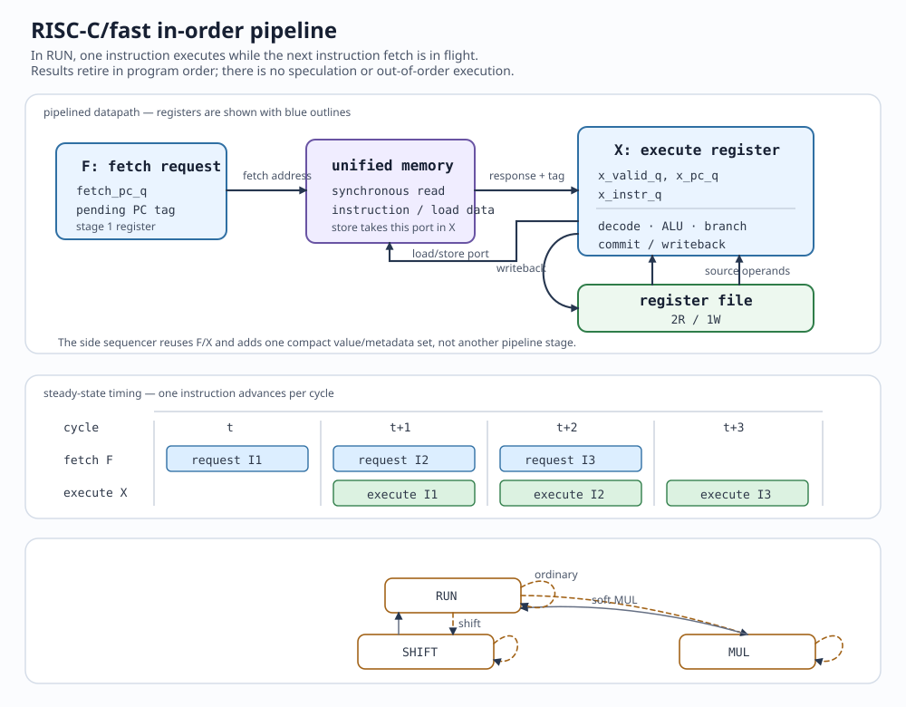
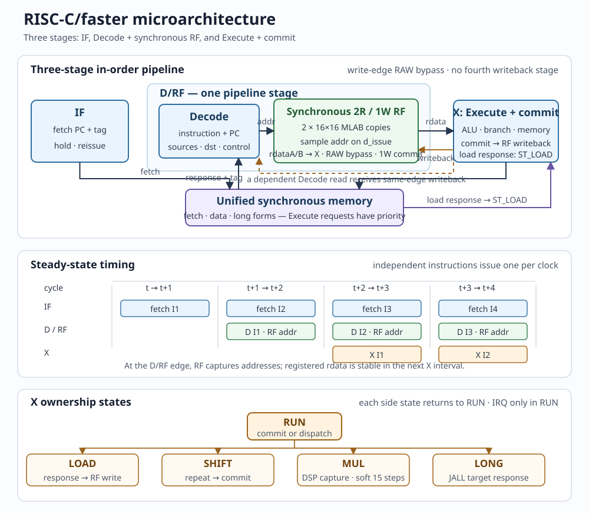

# RISC-C Hardware Manual

This manual covers RISC-C RTL implementations, FPGA targets, validation,
measurement, and board demos. The normative instruction definition is the
[ISA specification](RISC-C-ISA.md). Software development, assembly, C, runtime,
and linker-layout guidance is in the [Programming manual](PROGRAMMING.md).

## 1. Implementation family

RISC-C has serial and pipelined in-order implementations. The serial family
trades cycles for low logic use; Fast and Faster trade more logic for
throughput. All execute from a synchronous unified memory interface.

### Core families

| Implementation | RTL | Architecture | Profile |
|---|---|---|---|
| Nano | [`riscc_nano.v`](../rtl/riscc_nano.v) | fixed one-bit serial core | `nano` |
| RC16 Min | [`riscc_min.v`](../rtl/riscc_min.v), [`riscc16_min.v`](../rtl/riscc16_min.v) | serial `/1` to `/16` | `min` |
| RC16 Sys | [`riscc_sys.v`](../rtl/riscc_sys.v), [`riscc16_sys.v`](../rtl/riscc16_sys.v) | serial `/1` to `/16` | `sys` |
| RC16 Full | [`riscc_full.v`](../rtl/riscc_full.v), [`riscc16_full.v`](../rtl/riscc16_full.v) | serial `/1` to `/16`, `MUL` | `full` |
| RC32 Min | [`riscc32_min.v`](../rtl/riscc32_min.v) | 32-bit serial `/1` to `/16` | RC32 `min` |
| Fast | [`riscc16_fast.v`](../rtl/riscc16_fast.v) | two-stage pipeline | `full` |
| Faster | [`riscc16_faster.v`](../rtl/riscc16_faster.v) | three-stage pipeline | `full` |

Nano is an incompatible profile with its own register file and control path;
it is not a parameter setting of `min`. RC32 hardware currently implements
only `min`; RC32 `sys`, `full`, and RC32X are not yet implemented.

### Serial cores

The RC16 `/1` through `/8` cores stream a 16-bit word least-significant bits
first through a `W`-bit ALU. Arithmetic, comparison, address generation, and
PC updates share that ALU. A single-port register file stores `r0..r7` and
`S0..S7`; register-register instructions stage one source. Loads, stores,
shifts, and multiplication consume additional cycles rather than adding wide
datapaths.

Serial Sys `/1` through `/8` uses one state encoding across FPGA targets, RF
mappings, and area/timing builds. Serial Full uses one encoding per datapath
width. The RTL keeps width-dependent datapath forms only where the serial
slice actually changes; equivalent target-specific Boolean and state-map
spellings are deliberately avoided because their apparent single-seed timing
changes are not robust.

RC16 `/16` is a separate multi-cycle implementation with a full-width
datapath. RC32 Min applies the same serial organization to 32-bit words at
widths `/1`, `/2`, `/4`, `/8`, and `/16`. Nano is fixed at one bit and omits
the mainline S-register and system paths.

PCs, links, and data addresses are byte addresses. Ordinary loads access the
unified code/data space, so the cores require no separate program-load path.
Reserved instruction encodings are implementation don't-cares: RC16 Sys/Full
alias the unused `00` major space to the JAL16 path. RC16 `/16` Sys also
aliases reserved system-row `rb[2]` forms to JALR/MFS/MTS.


### Pipelined cores

Fast is a two-stage Fetch/Execute pipeline. Its replicated two-read register
file maps to EBRs on iCE40, LUTRAM on ECP5, and MLABs on Agilex. It has no
branch predictor or general forwarding network; the iCE40 EBR version can
stall for a read-after-write dependency.

Faster is a three-stage Fetch/Decode/Execute Agilex design. Its write-edge
bypass resolves the normal dependent writeback case. A registered DSP
multiplier is used by default; `RISCC_FASTER_SOFT_MUL` selects iterative ALM
logic.





### FPGA targets and build names

The reference targets are iCE40, ECP5, and Agilex 3. RC16 target names follow
`<verb>-<width>-<profile>`; Nano uses `<verb>-nano`. The optional RC16 Full
cores use the `mulh` and `muldiv` suffixes. Examples: `make test-16-sys`,
`make test-16-muldiv`, `make area-2-min`, and `make fmax-8-full`.

## 2. Measurements

The area tables are **core-only**: they include the register file but exclude
instruction/data memory, peripherals, and board logic. iCE40 and ECP5 figures
are reproducible open-FPGA measurements; run `make -j16 tables` to regenerate
them. The Agilex Sys figures are fresh Quartus post-fit measurements; the other
Agilex profiles remain published implementation snapshots. Its Fmax figures
are restricted-Fmax estimates rather than timing closure at every listed
clock.
Use `AGILEX_RC16_ONLY` with `characterize-agilex-rc16` to refresh only the
affected configurations; for example, `sys1 sys2 sys4 sys8 sys16`.

Sys is uniformly Min plus the interrupt/IE path and JALL/JMPL: it retains
Min's single-step right shifts at every width. The Agilex Sys row was refreshed
from this lean implementation with the same MLAB-RF core harness and fixed
seeds as the previous characterization.
On iCE40 `/16`, the JALL/JMPL path adds four LUT4 over the corresponding
interrupt-only Sys datapath by reusing its load capture and MDR writeback.

| iCE40 LUT4 | /1 | /2 | /4 | /8 | /16 |
|---|---:|---:|---:|---:|---:|
| `min` | 119 | 133 | 161 | 216 | 258 |
| `sys` | 145 | 157 | 186 | 243 | 278 |
| `full` | 171 | 188 | 232 | 297 | 335 |
| RC32 `min` | 145 | 154 | 179 | 222 | 305 |
| nano | 94 | — | — | — | — |
| Fast soft / DSP | — | — | — | — | 486 / 454 |

| ECP5 LUTs (RF included) | /1 | /2 | /4 | /8 | /16 |
|---|---:|---:|---:|---:|---:|
| `min` | 164 | 180 | 201 | 252 | 286 |
| `sys` | 182 | 198 | 226 | 279 | 305 |
| `full` | 209 | 231 | 270 | 333 | 360 |
| RC32 `min` | 229 | 242 | 264 | 293 | 373 |
| nano | 115 | — | — | — | — |
| Fast soft / DSP | — | — | — | — | 536 / 488 |

| ECP5 LUTs (block RF) | /1 | /2 | /4 | /8 | /16 |
|---|---:|---:|---:|---:|---:|
| `min` | 121 | 140 | 165 | 220 | 261 |
| `sys` | 140 | 158 | 190 | 245 | 281 |
| `full` | 166 | 190 | 234 | 300 | 336 |
| RC32 `min` | 149 | 162 | 189 | 234 | 307 |
| nano | 94 | — | — | — | — |

RC32 Min costs about 3–22% more iCE40 LUT4 than the corresponding RC16 Min
width. At `/8` and `/16` it reuses the serial ALU for arithmetic, address
generation, PC updates, and literal addressing; narrower configurations use
a smaller dedicated PC path. Wider registers and native 32-bit transfers
account for most of the remaining difference. RC32 timing rows are single-seed
measurements.

| Agilex 3 ALMs | /1 | /2 | /4 | /8 | /16 |
|---|---:|---:|---:|---:|---:|
| `min` | 93.7 | 100.1 | 108.0 | 120.1 | 118.0 |
| `sys` | 104.1 | 106.9 | 120.7 | 137.7 | 150.7 |
| `full` | 100.8 | 121.9 | 127.8 | 148.6 | 170.8 |
| nano | 88.4 | — | — | — | — |
| Fast soft / DSP | — | — | — | — | 271.3 / 264.8 |
| Faster DSP / soft | — | — | — | — | 318.0 / 342.6 |


### Clock rate and benchmark throughput

| UP5K Fmax (MHz) | /1 | /2 | /4 | /8 | /16 |
|---|---:|---:|---:|---:|---:|
| `min` | 36.39 | 34.95 | 32.01 | 29.34 | 27.77 |
| `sys` | 35.63 | 32.19 | 32.17 | 28.86 | 29.25 |
| `full` | 34.19 | 30.73 | 30.50 | 28.13 | 27.52 |
| RC32 `min` | 36.61 | 29.11 | 25.70 | 28.00 | 25.04 |

| ECP5 Fmax (MHz) | /1 | /2 | /4 | /8 | /16 |
|---|---:|---:|---:|---:|---:|
| `min` | 104.44 | 104.94 | 88.72 | 76.07 | 89.18 |
| `sys` | 107.87 | 106.88 | 93.53 | 86.60 | 87.23 |
| `full` | 94.93 | 95.16 | 84.76 | 76.75 | 84.23 |
| RC32 `min` | 99.22 | 92.34 | 81.68 | 78.64 | 76.86 |

| Agilex 3 Fmax (MHz) | /1 | /2 | /4 | /8 | /16 |
|---|---:|---:|---:|---:|---:|
| `min` | 323.42 | 317.76 | 289.44 | 278.71 | 270.12 |
| `sys` | 308.64 | 290.78 | 264.62 | 268.67 | 245.04 |
| `full` | 304.79 | 313.28 | 313.68 | 283.37 | 245.46 |

| Other implementation Fmax (MHz) | UP5K | ECP5 | Agilex 3 |
|---|---:|---:|---:|
| nano | 34.27 | 99.73 | 306.28 |
| Full paired MulH `/16` | 26.94 | 84.90 | — |
| Full paired MulDiv `/16` | 23.38 | 82.64 | — |
| Fast soft | 24.67 | 70.86 | 191.83 |
| Fast DSP | 24.25 | 68.68 | 149.05 |
| Faster DSP | — | — | 242.37 |
| Faster soft | — | — | 247.34 |

The throughput tables use a common benchmark. The serial columns use the Sys
area/Fmax point; Fast uses its synchronous-RF cycle count on iCE40 and its
generic cycle count on ECP5 and Agilex. Faster has validation and benchmark
targets, but no standalone open-FPGA area/Fmax target.

| Benchmark MIPS | /1 | /2 | /4 | /8 | /16 | nano | fast soft | fast DSP | faster DSP | faster soft |
|---|---:|---:|---:|---:|---:|---:|---:|---:|---:|---:|
| iCE40 UP5K | 1.01 | 1.68 | 2.87 | 4.02 | 7.02 | 1.10 | 11.04 | 12.51 | — | — |
| ECP5 | 3.06 | 5.56 | 8.35 | 12.08 | 20.93 | 3.21 | 39.76 | 46.85 | — | — |
| Agilex 3 | 8.75 | 15.14 | 23.62 | 37.47 | 58.80 | 9.86 | 107.63 | 101.67 | 142.92 | 125.39 |

| Benchmark MIPS per thousand logic units | /1 | /2 | /4 | /8 | /16 | nano | fast soft | fast DSP | faster DSP | faster soft |
|---|---:|---:|---:|---:|---:|---:|---:|---:|---:|---:|
| iCE40 UP5K, LUT4 | 7.0 | 10.7 | 15.4 | 16.6 | 25.2 | 11.7 | 22.7 | 27.6 | — | — |
| ECP5, block RF sites | 21.8 | 35.2 | 43.9 | 49.3 | 74.5 | 34.2 | 74.2 | 96.0 | — | — |
| ECP5, LUTRAM RF sites | 16.8 | 28.1 | 36.9 | 43.3 | 68.6 | 27.9 | 74.2 | 96.0 | — | — |
| Agilex 3, ALM | 84.0 | 141.6 | 195.7 | 272.1 | 390.1 | 111.6 | 396.7 | 384.0 | 449.4 | 366.0 |

The common mainline benchmark retires 3238 instructions; Nano's
software-multiply version retires 8491 instructions. When comparing ISA
revisions with different dynamic instruction counts, Fmax divided by benchmark
cycles is the corresponding fixed-workload throughput measure.

### Benchmark cycles

| Common benchmark cycles | /1 | /2 | /4 | /8 | /16 | nano | fast soft | fast DSP | faster DSP | faster soft |
|---|---:|---:|---:|---:|---:|---:|---:|---:|---:|---:|
| `test_riscc_bench` | 114228 | 62196 | 36276 | 23220 | 13495 | 263691 | 5771 | 4747 | 5491 | 6387 |

The iCE40 Fast variants take 7236 cycles (soft multiply) or 6276 cycles (DSP
multiply) on the same benchmark because their EBR register files are
synchronous.

### Full multiply/divide options

The normal `full` core provides low-half `MUL`. Separate RC16 `/16` variants
add paired `MULHU`, or paired `MULHU` and `DIVU`. They reuse the multi-cycle
datapath, making them a speed option rather than a new high-throughput unit.

| Implementation | iCE40 LUT4 | ECP5 LUTRAM RF | ECP5 block RF |
|---|---:|---:|---:|
| Full (`MUL`) | 335 | 360 | 336 |
| Full paired MulH (`MUL` + paired `MULHU`) | 346 | 370 | 346 |
| Full paired MulDiv (`MUL` + paired `MULHU` + `DIVU`) | 374 | 401 | 377 |

| Routed Fmax (MHz) | iCE40 UP5K | ECP5 LFE5U-25F |
|---|---:|---:|
| Full (`MUL`) | 27.52 | 84.23 |
| Full paired MulH (`MUL` + paired `MULHU`) | 26.94 | 84.90 |
| Full paired MulDiv (`MUL` + paired `MULHU` + `DIVU`) | 23.38 | 82.64 |

`test-all` validates both optional cores in generic and ECP5 register-file
configurations. Use `make fmax-16-mulh` or `make fmax-16-muldiv` to reproduce
their routed timing.

Enable MDU in the Full toolchain with `-mcpu=full -mmdu`. LLVM uses `MULHU`
and `DIVU` directly where appropriate, and the runtime uses them for wider
integer and floating-point helpers. The table shows actual RC16 RTL cycles at
`-O2` for Full with and without MDU.

| Compiler benchmark | Full cycles | Full + MDU cycles | cycle change |
|---|---:|---:|---:|
| `int32` | 218649 | 205597 | -5.97% |
| `softfloat` | 540249 | 512180 | -5.20% |
| `libm32` | 42025 | 40858 | -2.78% |
| `matrix` | 268233 | 234811 | -12.46% |
| `structures` | 11441 | 11441 | 0.00% |
| all five workloads | 1080597 | 1004887 | -7.01% |

This is a cycle comparison; use the routed Fmax table when judging elapsed
time for a target FPGA. MDU increases the binary32 divide helper from 352 to
402 bytes, so it remains a speed choice rather than a size optimization.

## 3. FPGA toolchain

The open-source flow needs yosys, Verilator 5 or newer, g++, Python 3,
nextpnr-ice40, nextpnr-ecp5, icestorm, prjtrellis, and optionally ccache and
openFPGALoader. On Debian/Ubuntu:

```sh
sudo apt-get install -y build-essential make python3 ccache libsdl2-dev libstb-dev \
  verilator yosys nextpnr-ice40 nextpnr-ecp5 fpga-icestorm fpga-trellis \
  openfpgaloader
```

The Makefile finds tools on `PATH`; override them per command when necessary,
for example:

```sh
make VERILATOR=/opt/verilator/bin/verilator YOSYS=/opt/yosys/bin/yosys test-all
make NEXTPNR_ECP5=/opt/oss-cad-suite/bin/nextpnr-ecp5 icepi-zero-demo-bit
make QUARTUS_SH=/opt/intelFPGA_pro/26.1/quartus/bin/quartus_sh atum-a3-demo
```

When installed, ccache accelerates generated Verilator C++, the C++ ISS, and
the LLVM host build. Yosys synthesis is not a ccache workload.

## 4. Validation

```sh
make test-all
make test-compiler
make fuzz-all
make -j16 tables
```

`test-all` runs the serial RC16 matrix, Nano, optional MulH/MulDiv cores, RC32
Min at every width, every Fast target variant, and both Faster variants.
`test-compiler` adds compiler, libc, Nano compiler/RTL, and encoding tests.
`fuzz-all` differentially compares self-checking generated programs between
the ISS and trace-enabled RTL, reporting a replay command for any failure.

Trace targets (`trace-nano`, `trace-<width>-<profile>`, and `trace-fast`)
record architectural state and written memory after every instruction. Use
them to locate the first divergent instruction when a differential test fails.

## 5. Board builds and demos

Each board SoC provides:

- on-chip program/data RAM;
- a 4-bit framebuffer and board-local video output;
- a UART, a 1 kHz timer, and a two-source interrupt controller; and
- LED outputs and button inputs.

The shared software-visible map is:

| Byte address or range | Demo function |
|---:|---|
| `0x0000..0x7fff` | Icepi unified program/data RAM |
| `0x0000..0x5fff` | Atum unified program/data RAM |
| `0x8000..0xffee` | Icepi framebuffer aperture; its first 14,400 words are the displayed 320x180 framebuffer, four adjacent 4-bit pixels per 16-bit word; CPU writes only |
| `0x6000..0xd07f` | Atum displayed 320x180 framebuffer: four adjacent 4-bit pixels per 16-bit word; CPU writes only |
| `0xfff0..0xfff2` | UART; see the [Programming manual](PROGRAMMING.md#1-software-tools-and-the-iss) for register semantics |
| `0xfff4` | timer: write a non-zero 1 kHz delay to arm/rearm; read the free-running 16-bit millisecond tick counter |
| `0xfff6` | interrupt state: read pending UART/timer bits 0/1; write enable mask |
| `0xfff8` | LED output; Icepi uses five low bits and Atum uses four |

Both active framebuffers use 14,400 16-bit words. The rest of the Icepi
framebuffer aperture is reserved; only `0xfff0..0xffff` is MMIO. The UART
divisor is board-local. [`<riscc/platform.h>`](../firmware/include/riscc/platform.h)
defines the shared C interface.

The interrupt controller is a two-bit level mask for UART and timer sources.
It has no priority, vectoring, edge capture, or acknowledgement register. The
timer uses a board-local 1 kHz timebase, and both boards retain the fixed
RISC-C IRQ vector.

### Icepi Zero

The Icepi demo is in [`boards/icepi_zero`](../boards/icepi_zero). It uses a
50 MHz Fast SoC, a 320x180 4-bit framebuffer scaled to 640x480 DVI, UART,
LEDs, buttons, and freestanding C++ Julia-set firmware. The complete ECP5
design uses 902 LUT4s, 32 EBRs, and one DSP block. Its PLL, TMDS encoder, and
DDR serializer are maintained in-tree.

```sh
make icepi-zero-demo-iss
make icepi-zero-demo-iss-test
make icepi-zero-demo-rtlsim
make icepi-zero-demo-bit
```

The default shared source is
[`demo.cpp`](../boards/shared/sw/demo.cpp), compiled as freestanding C++
without a C++ standard library, exceptions, RTTI, or constructors. For an
alternate C++ or assembly image on both boards, set `DEMO_PROGRAM`. Set
`ICEPI_PROGRAM` or `ATUM_PROGRAM` to override only that board.

The bit target only builds a bitstream. Load it temporarily through SRAM with:

```sh
openFPGALoader -cft231X --pins=7:3:5:6 build/icepi_zero/demo.bit
```


*Video capture of RISC-C running on the Icepi Zero FPGA board.*

### Terasic Atum A3 Nano

[`boards/atum_a3_nano`](../boards/atum_a3_nano) is the Quartus Pro Agilex 3
demo. It combines a Faster SoC, UART, on-chip program RAM, and a 320x180
4-bit framebuffer expanded to 1920x1080p60 through the TFP410. Firmware, ISS,
and RTL simulation use the same freestanding C++ demo as Icepi, with an
Atum-specific banner:

```sh
make atum-a3-demo-bin
make atum-a3-demo-iss
make atum-a3-demo-rtlsim
```

Generating a `.sof` needs Quartus Pro with Agilex 3 device support:

```sh
make atum-a3-demo
```

The staged project and `.sof` live under `build/atum_a3_nano/quartus`. JTAG
configuration is temporary and leaves the QSPI flash unchanged:

```sh
quartus_pgm -l
quartus_pgm -c "Atum A3 Nano [USB-0]" -m jtag \
  -o "p;build/atum_a3_nano/quartus/output_files/atum_a3_nano.sof"
```

The Quartus Pro 26.1 post-fit design uses 719.3 ALMs, 27 M20K blocks, one DSP
block, and two IOPLLs. The 148.5 MHz pixel clock meets timing. The 225 MHz
system target has not closed timing; its current restricted Fmax is 195.47 MHz.
Persistent QSPI programming is outside the normal flow; see Terasic's
[Atum A3 Nano documentation](https://www.terasic.com.tw/cgi-bin/page/archive.pl?CategoryNo=44&Language=English&No=1373&PartNo=4).


*Video capture of RISC-C running on the Atum-A3-Nano FPGA board.*
